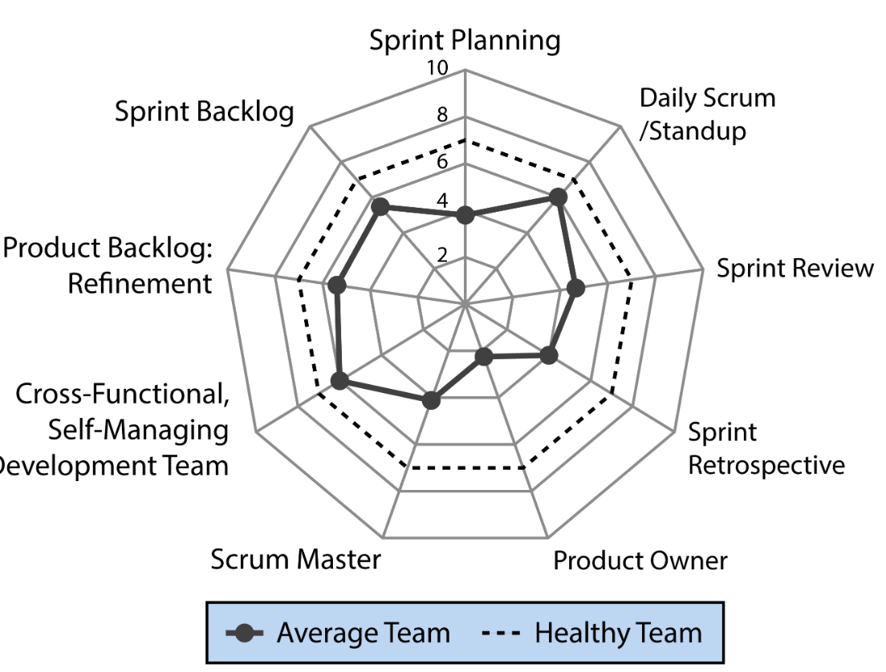

Companies want more effective software development for its own sake. They also want more effective software development because software enables so many other business functions. The _State of DevOps Report_ found that, “Firms with high-performing IT organizations were twice as likely to exceed their profitability, market share, and productivity goals” (Puppet Labs, 2014). High-performing companies were twice as likely to meet or exceed their goals for customer satisfaction, quality and quantity of work, operating efficiency, and other objectives.
Selective, well-informed use of modern Agile practices offers a proven path toward more effective software development and all the benefits that go with it.

Unfortunately, most organizations are not realizing the potential of Agile practices because most implementations of Agile practices are not effective. For example, Scrum is the most common Agile practice, and it can be incredibly powerful, yet we have most often seen it implemented in ways that fail to realize its benefits. The diagram below compares the average Scrum team my company has seen to a healthy Scrum team.

We typically see only one of Scrum’s key elements being applied effectively (daily scrum/standup), and even that’s far from universal. The rest of Scrum’s elements are applied sporadically or not at all. 

A poor implementation of a potentially good practice is not the only source of Agile failure. The term “Agile” has become an umbrella term that covers myriad practices, principles, and theories. We have seen Agile implementations fail because organizations are not aligned on what they mean by “Agile.”

### Different emphases between Sequential development and Agile development

The most meaningful contrast with Agile development today is _Sequential development_. Mischaracterizations aside, the contrasts are shown in the following table.

| Sequential Development                                                                 | Agile Development                                                                       |
| -------------------------------------------------------------------------------------- | --------------------------------------------------------------------------------------- |
| Long release cycles                                                                    | Short release cycles                                                                    |
| Most end-to-end development work performed in large batches across long release cycles | Most end-to-end development work performed in small batches within short release cycles |
| Detailed up-front planning                                                             | High-level up-front planning with just-in-time detailed planning                        |
| Detailed up-front requirements                                                         | High-level up-front requirements with just-in-time detailed requirements                |
| Up-front design                                                                        | Emergent design                                                                         |
| Test at the end, often as separate activity                                            | Continuous, automated testing, integrated into development                              |
| Infrequent structured collaboration                                                    | Frequent structured collaboration                                                       |
| Overall approach is idealistic, prearranged, and control-oriented                      | Overall approach is empirical, responsive, and improvement-oriented                     |

Here are more details on these different emphases:

- **Short release cycles vs. long release cycles:** Teams using Agile practices develop working software in cycles measured in days or weeks. Teams using Sequential practices measure their development cycles in months or quarters.

- **End-to-end development work performed in small batches vs. large batches:** Agile development emphasizes complete development— including detailed requirements, design, coding, testing, and documentation—in small batches, meaning a small number of features or requirements at a time. Sequential development emphasizes moving an entire project’s worth of requirements, design, coding, and testing through the development pipeline at the same time in large batches.

- **Just-in-time planning vs. up-front planning:** Agile development typically does only a little planning up-front and leaves most of the detailed planning to be done just in time. Well-done Sequential development also does a lot of its planning just in time, but Sequential practices such as earned value project management put a stronger emphasis on planning in more detail up-front.

- **Just-in-time requirements vs. up-front requirements:** Agile development focuses on doing as little requirements work as possible up front (emphasizing breadth rather than details); it delays the vast majority of detailed requirements work until it is needed after the project is underway. Sequential development defines most requirements details up-front.
  Requirements is an area in which modern Agile practices have moved beyond the ideas that were associated with Agile development in the early 2000s. I’ll discuss those changes in the “[More Effective Agile Requirements Creation](https://www.educative.io/courses/more-effective-agile-a-roadmap-for-software-leaders/agile-requirements-lifecycle)” chapter and the “[More Effective Agile Requirements Prioritization](https://www.educative.io/courses/more-effective-agile-a-roadmap-for-software-leaders/product-owner)” chapter.
  
- **Emergent design vs. up-front design:** As with planning and requirements, Agile defers detailed elaboration of design work until it is needed, with minimal emphasis on up-front architecture. Sequential development emphasizes developing a greater level of detail up-front. 
  The acknowledgment of value in _some_ up-front design and architecture work is another area in which modern Agile has moved beyond the early Agile philosophy of the 2000s.

- **Continuous, automated testing integrated with development vs. separate test at the end:** Agile development emphasizes testing as something that is done concurrently with coding, sometimes preceding coding. It is performed by integrated development teams that include both developers and test specialists. Sequential development treats testing as an activity that is done separately from development and typically after development has occurred. Agile development emphasizes automating tests so that tests can be run more often by more people.

- **Frequent structured collaboration vs. infrequent structured collaboration:** Agile development emphasizes frequent, structured collaboration. These collaborations are often short (15-minute daily standup meetings), but they are structured into the day-by-day, week-by-week rhythm of Agile work. Sequential development certainly does not prevent collaboration, but it doesn’t particularly encourage it, either.

- **Empirical, responsive, improvement-oriented vs. idealistic, prearranged, control-oriented:** Agile teams emphasize an empirical approach. They focus on learning from real-world experience. Sequential teams try to learn from the experience too, but they place greater emphasis on defining a plan and imposing order on reality rather than observing reality and constantly adapting to it.

Well-run projects emphasize good management, a high level of customer collaboration, and high-quality requirements, design, coding, and testing—regardless of whether the projects use Agile or Sequential approaches.

### Suggested Leadership Actions
Agile teams and the leaders of Agile teams should regularly investigate and evolve most factors in their efforts. This principle is so important that I have included “Suggested Leadership Actions”—organized into Inspect and Adapt activities.

**Inspect**
- Reflect on the degree to which you’ve previously considered Agile to be an all-or-nothing proposition. To what degree has that affected your approach to improving management and technical practices?
- Talk to at least three technical leaders in your organization. Ask them what they mean by “Agile.” Ask them what specific practices they are referring to. To what degree do your technical leaders agree on what Agile means? Do they agree on what is not Agile?
- Talk to non-technical leaders about what Agile means to them. How do they perceive the boundary or interface between their work and your software teams?
- Review your project portfolio in terms of the emphases described in the previous lesson’s table. Rate your projects on each factor, with 1 being entirely Sequential and 5 being entirely Agile.

**Adapt**
- Write down a preliminary approach to drawing the “Agile boundary” in your organization.
- Write a list of questions to answer as you read the rest of this course.

Agile teams should avoid being idealistic about their practices and instead adjust their practices based on empirical observations about what has been proved to work. Agile teams should regularly Inspect and Adapt _everything_—plans, designs, code quality, tests, processes, team interactions, organizational interactions—every factor that can make a difference in a team’s effectiveness. This is not a license to adapt without inspecting. Changes should be based on experience.

