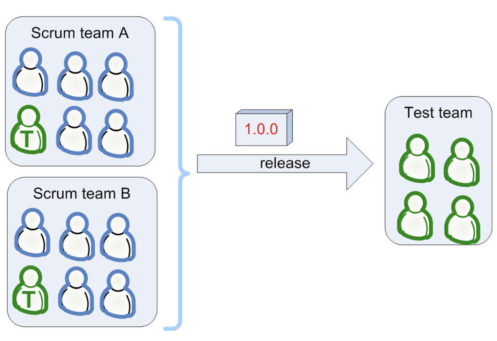
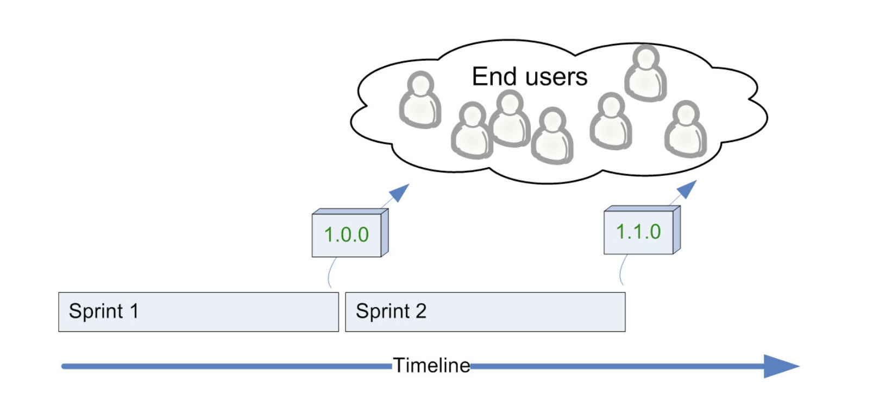
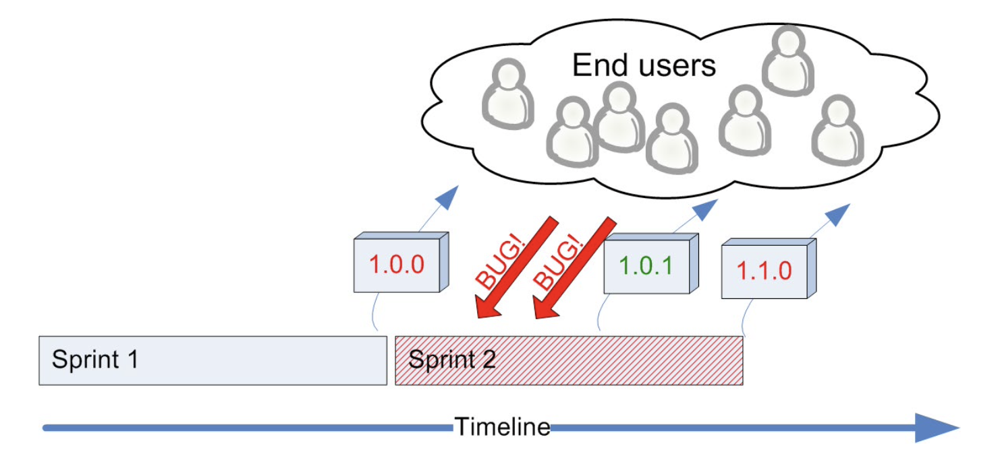
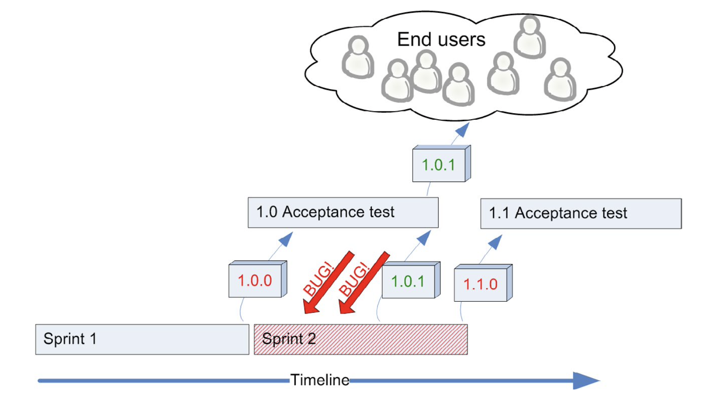
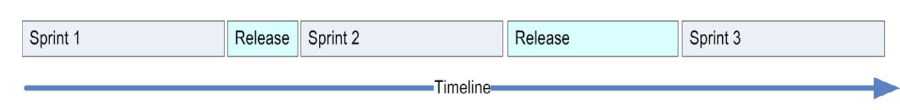
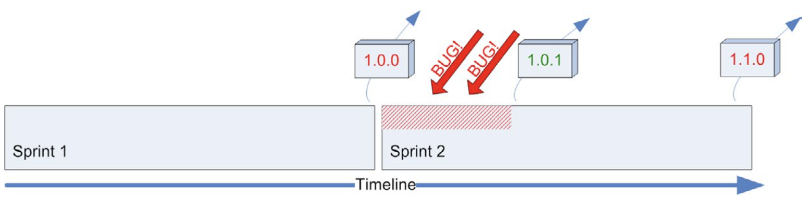

Testing is the part that probably will vary most between different organizations. Depending on how many testers you have, how much test automation you have, what type of system you have (just server and Web app or do you actually ship boxed software?), size of release cycles, how critical the software is (blog server vs. flight control system), etc.

#### You probably can’t get rid of the acceptance-test phase
In the ideal Scrum world, a sprint results in a potentially deployable version of your system. So just deploy it, right?

Wrong. Our experience is that this usually doesn’t work. There will be nasty bugs. If quality has any sort of value to you, some kind of manual acceptance testing phase is required.

 > Manual testing is important and to some extent is unavoidable. But it should be done by the team in the sprint, not handed off to some separate group or saved for a future testing phase. That’s why we ditched the waterfall model, remember?

 That’s when dedicated testers that are not part of the team hammer the system with those types of tests that the Scrum team couldn’t think of, or didn’t have time to do, or didn’t have the hardware to do. The testers access the system in exactly the same way as the end users, which means they must be done manually (assuming your system is for human users).

 
 
 The test team will find bugs, the Scrum team will have to do bug-fix releases, and sooner or later (hopefully sooner) you will be able to release a bug-fixed version 1.0.1 to the end users, rather than the shaky version 1.0.0.

When I say “acceptance-test phase” I am referring to the whole period of testing, debugging, and re-releasing until there is a version good enough for production release.

#### Minimize the acceptance-test phase
The acceptance test phase hurts. It feels distinctly un-agile.

> In some environments it may seem unavoidable. But my point is, I used to think it was unavoidable. But now I’ve seen how really agile companies move fast and increase quality by getting rid of the separate acceptance-test phase and merging that work into the sprint. So if you think it is unavoidable, it may be that you are blinded by your status quo (as I was). Nevertheless, this chapter provides some useful patterns for how to deal with separate acceptance testing, as a temporary measure until you manage to merge it all into the sprint.

Although we can’t get rid of it, we can (and do) try to minimize it. More specifically, minimize the amount of time needed for the acceptance test phase. This is done by:
- Maximizing the quality of the code delivered by the Scrum team and maximizing the efficiency of the manual test work (i.e. find the best testers, give them the best tools, make sure they report time-wasting tasks that could be automated)
So how do we maximize the quality of the code delivered from the Scrum team? Well, there are lots of ways. Here are two that we find work very well:
- Put testers in the Scrum team.
- Do less per sprint.

#### Increase quality by putting testers in the Scrum team
“tester” in this case is “a guy whose primary skill is testing” rather than “a guy whose role is to do only testing”.

> “Cross-functional” doesn’t mean everyone knows everything. It just means that everyone is willing to do more than just their own thing. We want a nice mix of specialization and cross- functionality. So the whole team is collectively responsible for the quality of their product, and just about everyone will be involved in testing. The tester, however, will guide this work, pair with developers on test automation, and personally do the more complex manual testing.

#### The tester is the “sign-off guy”
Nothing is considered “done” in a sprint until he says it’s done. We’ve found that developers often say something is done when it really isn’t. Even if you have a very clear definition of “done”, developers will frequently forget it. We programmers are impatient people and want to move on to the next item ASAP.
In many cases it turns out that something a developer considered to be “done” wasn’t even possible to test! Because it wasn’t checked in, or wasn’t deployed to the test server, or couldn’t be started, or whatever. Once Mr. T has tested the feature, he should go through the “done” checklist (if you have one) with the developer. For example, if the definition of done mandates that there should be a release note, then Mr. T checks that there is a release note. If there is some kind of more formal specification for this feature (rare in our case) then Mr. T checks up on that as well, etc.
A nice side effect of this is that the team now has a guy who is perfectly suited to organize the sprint demo.

> I’m not a big fan of the sign-off guy pattern any more. It introduces a bottleneck and puts too much responsibility in the hands of one person. But I can see it being useful under some circumstances (it certainly was useful at the time). Also, if anyone should sign off on the quality, it should be a real user.

#### What does the tester do when there is nothing to test?
It may take a week before the team completes the first story, so what should the tester do during that time?
Well, first of all, he should be preparing for tests. That is, writing test specs, preparing a test environment, etc. So when a developer has something that is ready to test, there should be no waiting, Mr. T should dive right in and start testing.
If the team is doing TDD then people spend time writing test code from day one. The tester should pair-program with developers that are writing test code. If the tester can’t program at all, he should still pair-program with developers, except that he should only navigate and let the developer do the typing. A good tester usually comes up with different types of tests than a good developer does, so they complement each other.
If the team is not doing TDD, or if there isn’t enough test-case writing to fill up the tester’s time, he should simply do whatever he can to help the team achieve the sprint goal. Just like any other team member. If the tester can program then that’s great. If not, your team will have to identify all non-programming tasks that need to be done in the sprint.
When breaking down stories into tasks during the sprint planning meeting, the team tends to focus on programming tasks. However, usually, there are lots of non-programming tasks that need to be done in the sprint. If you spend time trying to identify the non-programming tasks during the sprint planning phase, chances are Mr. T will be able to contribute quite a lot, even if he can’t program and there is no testing to do right now.
Examples of non-programming tasks that often need to be done in a sprint:
- Set up a test environment.
- Clarify requirements.
- Discuss deployment details with operations.
- Write deployment documents (release notes, RFC, or whatever your organization does).
- Contact with external resources (GUI designers for example).
- Improve build scripts.
- Further break down stories into tasks.
- Identify key questions from the developers and get them answered.

 Let’s say we are on the last day of the sprint and suddenly lots of stuff is done and Mr. T doesn’t have a chance to test everything. What do we do? Well we could make everybody in the team into Mr. T’s assistants. He decides which stuff he needs to do himself, and delegates grunt testing to the rest of the team. That’s what cross-functional teams are all about!
 So yes, Mr. T does have a special role in the team, but he is still allowed to do other work, and other team members are still allowed to do his work.

> This is a good way of looking at all other competencies in the team as well.
#### Increase quality by doing less per sprint
This goes back to the sprint planning meeting. Simply put, don’t cram too many stories items into the sprint! If you have quality problems, or long acceptance-test cycles, do less per sprint! This will almost automatically lead to higher quality, shorter acceptance-test cycles, fewer bugs affecting end users, and higher productivity in the long run since the team can focus on new stuff all the time rather than fixing old stuff that keeps breaking.
It is almost always cheaper to build less, but build it stable, rather than to build lots of stuff and then have to do panic hot fixes.
#### Should acceptance testing be part of the sprint?
We waver a lot here. Some of our teams include acceptance testing in the sprint. Most of our teams, however, don’t, for two reasons:
- A sprint is time-boxed. Acceptance testing (using my definition which includes debugging and re-releasing) is very difficult to time- box. What if time runs out and you still have a critical bug? Are you going to release to production with a critical bug? Are you going to wait until next sprint? In most cases both solutions are unacceptable. So we leave manual acceptance testing outside.
- If you have multiple Scrum teams working on the same product, the manual acceptance testing must be done on the combined result of both team’s work. If both teams did manual acceptance within the sprint, you would still need a team to test the final release, which is the integrated build of both teams’ work.

This is by no means a perfect solution but good enough for us in most cases.

> Again, strive to make acceptance testing part of each sprint. It takes a while to get there, but you won’t regret it. Even if you never get there, the act of trying will cause you to make lots of improvements to the way you work
#### Sprint cycles vs. acceptance-test cycles
In a perfect McScrum world, you don’t need acceptance-test phases since each Scrum team releases a new production-ready version of your system after each sprint.

> So no, you don’t need a perfect McScrum world for that. Just roll up your sleeves, figure out what’s stopping you from getting releaseable code every sprint, and fix the problems one by one. Of course, this can be more or less difficult depending on your domain, but still is worth trying. Just take whatever your release cycle is today (whether it is monthly or yearly or whatever), and gradually but continuously shorten it.

Well, here’s a more realistic picture:

After Sprint 1, a buggy version 1.0.0 is released. During Sprint 2, bug reports start pouring in and the team spends most of its time debugging and is forced to do a mid-sprint bug-fix release 1.0.1. Then at the end of Sprint 2, they release a new feature-version 1.1.0, which of course is even buggier since they had even less time to get it right this time due to all the disturbances from last release. Etc., etc.

Well, the sad thing is that the problem remains even if you have an acceptance-test team. The only difference is that most of the bug reports will come from the test team instead of from angry end users. That’s a huge difference from a business perspective, but for developers it amounts to almost the same thing. Except that testers are usually less aggressive than end users. Usually.

First of all, again, maximize the quality of the code that the Scrum team releases. The cost of finding and fixing bugs early, within a sprint, is just so extremely low compared to the cost of finding and fixing bugs afterwards.
But the fact remains, even if we can minimize the number of bugs, there will still be bug reports coming after a sprint is complete. How do we deal with that?
##### Approach 1: “Don’t start building new stuff until the old stuff is in production”
We’ve been close to adopting this approach several times, and have drawn fancy models of how we would do this. However, we always changed our minds when we realized the downside. We would have to add a non- time-boxed release period between sprints, where we do only testing and debugging until we can make a production release.

We didn’t like the notion of having non-time-boxed release periods between sprints, mainly because it would break the regular sprint heartbeat. We could no longer say that “every three weeks, we start a new sprint”. Besides, this doesn’t completely solve the problem. Even if we have a release period, there will be urgent bug reports coming in from time to time, and we have to be prepared to deal with them.
That’s actually true. Even if you do manage to release continuously, you still need a way to deal with urgent bugs coming in. Because that will happen sometimes. No team is so good as to not have them. And the best way to deal with that is to leave a bit of slack in the sprint.
##### Approach 2: “OK to start building new stuff, but prioritize getting the old stuff into production”
This is our preferred approach. Right now at least.

Basically, when we finish a sprint, we move on to the next one. But we expect to be spending some time in the next sprint fixing bugs from the last sprint. If the next sprint gets severely damaged because we had to spend so much time fixing bugs from the previous sprint, we evaluate why this happened and how we can improve quality. We make sure sprints are long enough to survive a fair amount of bug fixing from the previous sprint.
Gradually, over a period of many months, the amount of time spent fixing bugs from previous sprints decreased. In addition, we were able to get fewer people involved when bugs did happen, so that the whole team didn’t need to get disturbed each time. Now we are at a more acceptable level.

During sprint planning meetings, we set the focus factor low enough to account for the time we expect to spend fixing bugs from last sprint. With time, the teams have gotten quite good at estimating this. The velocity metric helps a lot.

> Or just use yesterday’s weather – only pull in as many story points as you completed last sprint or the average completed over the last three sprints. Then your sprint will automatically have built-in slack to handle disruptions and hot fixes. You will automatically limit work to capacity, and move faster as a result
##### Bad approach: “Focus on building new stuff”
This in effect means “focus on building new stuff rather than getting old stuff into production”. Who would want to do that? Yet we made this mistake quite often in the beginning, and I’m sure many other companies do as well. It’s a stress-related sickness. Many managers don’t really understand that, when all the coding is finished, you are usually still far from production release. At least for complex systems. So the manager (or product owner) asks the team to continue adding new stuff while the backpack of old, almost-ready-to-release code gets heavier and heavier, slowing everything down.

> I’m consistently amazed by how many companies get stuck in this trap. All they have to do is limit the number of projects or features in progress. I’ve seen cases where companies become literally seven times faster by doing that. Imagine that – just as much stuff delivered, but seven times faster, without working harder or hiring people. And better quality as well, because of the shorter feedback loop. Crazy but true.

#### Don’t outrun the slowest link in your chain
Let’s say acceptance testing is your slowest link. You have too few testers, or the acceptance-test period takes long because of the dismal code quality.
Spend the rest of the time alleviating the testing bottleneck. For example:
- Have a few developers work as testers instead (oh, they will love you for that...).
- Implement tools and scripts that make testing easier.
- Add more automated test code.
- Increase sprint length and have acceptance tests included in sprint.
- Define some sprints as “test sprints” where the whole team works as an acceptance-test team.
- Hire more testers (even if that means removing developers).
 We’ve tried all of these solutions (except the last one). The best long- term solutions are of course points two and three, i.e. better tools and scripts and test automation. Retrospectives are a good forum for identifying the slowest link in the chain.

> This becomes self-adjusting if acceptance testing is included in the sprint, rather than done separately. Try it – make your definition of done include acceptance testing, and see what happens over time.
#### Back to reality
I’ve probably given you the impression that we have testers in all Scrum teams, that we have a huge acceptance test teams for each product that we release after each sprint, etc., etc.

Well, we don’t.

We’ve sometimes managed to do this stuff, and we’ve seen the positive effects of it. But we are still far from an acceptable quality-assurance process, and we still have a lot to learn there.

> Indeed, we did have a lot to learn.
