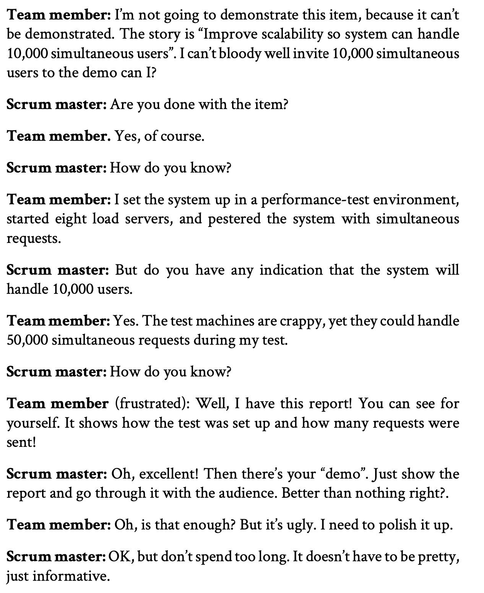

The sprint demo (or sprint review as some people call it) is an important part of Scrum that people tend to underestimate.
This is extra crucial in a multi-team context. Everyone involved needs to see the integrated product come together on a regular basis. There will always be integration problems, but the earlier you discover them, the easier they are to solve. Self-organization only works with transparency and feedback loops, and a well-executed sprint review provides both.
#### Checklist for sprint demos
- Make sure you clearly present the sprint goal. If there are people at the demo who don’t know anything about your product, take a few minutes to describe the product.
- Don’t spend too much time preparing the demo, especially not on flashy presentations. Cut the crap out and just focus on demonstrating actual working code.
- Keep a high pace, i.e. focus your preparations on making the demo fast-paced rather than beautiful.
- Keep the demo on a business-oriented level. Leave out the technical details. Focus on “what did we do” rather than “how did we do it”.
- If possible, let the audience try the product for themselves.
- Don’t demonstrate a bunch of minor bug fixes and trivial features. Mention them but don’t demo them, since that generally takes too long and detracts focus from the more important stories.

> Some teams do two reviews: a short public review, aimed at external stakeholders, followed by an internal review with more details and things like key challenges and technical decisions made along the way. A great way to spread knowledge between teams, and spare stakeholders from techy details they don’t care about.

#### Dealing with indemonstrable stuff
