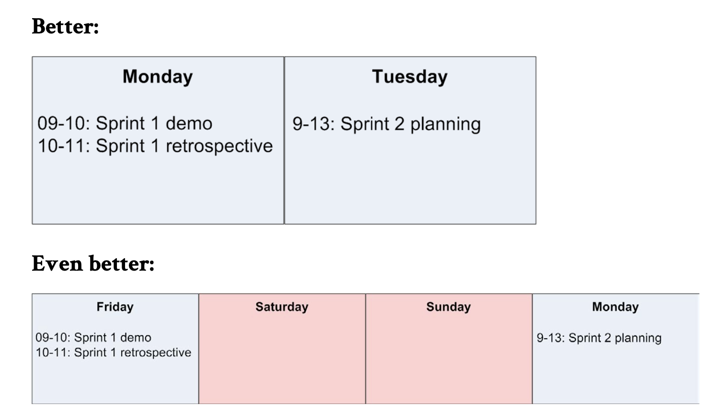
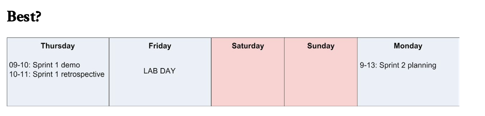

In real life, you can’t always sprint. You need to rest between sprints. If you always sprint, you are in effect just jogging.

 >Slack is super- important for both productivity and personal well being! If you’re one of those calendar-always-full people, try this: open your calendar and block off half a day per week, write “slack” or “unbookable” or something. Don’t decide in advance what you will do with that time, just see what happens.

After the sprint demo and retrospective, both the team and the product owner will be full of information and ideas to digest. If they immediately run off and start planning the next sprint, chances are nobody will have had a chance to digest any information or lessons learned, the product owner will not have had time to adjust his priorities after the sprint demo, etc.

We try to introduce some kind of slack before starting a new sprint (more specifically, the period after the sprint retrospective and before the next sprint planning meeting).
At the very least, we try to make sure that the sprint retrospective and the subsequent sprint planning meeting don’t occur on the same day. Everybody should at least have a good night’s sprintless sleep before starting a new sprint.

One way to do this is “lab days” (or whatever you choose to call them). That is, days where developers are allowed to do essentially whatever they want (OK, I admit, inspired by Google). For example, read up on the latest tools and APIs, study for a certification, discuss nerdy stuff with colleagues, code a hobby project, etc.

Our goal is to have a lab day between each sprint. That way you get a natural rest between sprints, and you will have a dev team that gets a realistic chance to keep their knowledge up to date. Plus it’s a pretty attractive employment benefit.

> After lots of experimentation at Spotify, we ended up doing company- wide hack weeks. Twice per year, we do a whole week of do-whatever- you-want, with a demo and party on Friday. The whole company, not just the tech folks. The amount of innovation this triggers is just amazing! And because everyone is doing it at the same time, teams are less likely to be derailed by dependencies. I made a video about Spotify’s engineering culture that describes the hack week and many other things. Check it out at http://tinyurl.com/spotifyagile