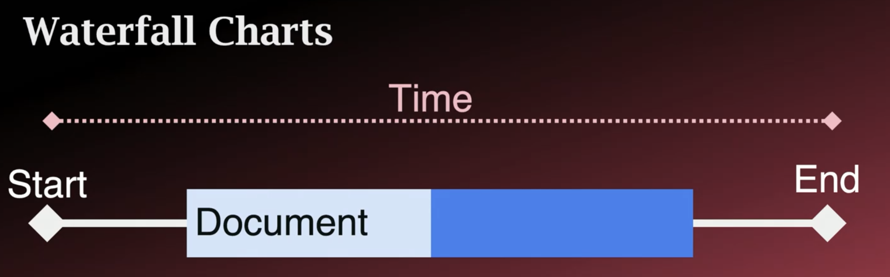

### References
- https://github.com/toddhgardner/fundametals-of-web-performance
### Definition
The **speed** and **efficiency** with which a website **loads**, **renders**, and **responds** to interactions from the visitors.

**User Expectation:** For effective communication, some response is needed within **two seconds of a request**.
A wait longer than two seconds **breaks concentration** and affects productivity.
- A user feels a response is instant at **.01 second**. And **uninterrupted flow** at 1 second.  **Feel frustration** at 10 seconds.
Source: Usability Engineering, Neilsen

### Measuring Web Performance

Waterfall Charts



**Legacy Metrics:** 

- **DOMContentLoaded** - The HTML downloaded and deferred scripts have executed.
-  When to use DOMContentLoaded - The structure of the page is done, but images may not be displayed

```js
window.addEventListener("DOMContentLoaded", (evt) => {
	console.log(`DOMContentLoaded at ${evt.timeStamp} ms`);
})
```

- **Load** - The HTML and all known resources have been downloaded and rendered, except those that are lazy-loaded.