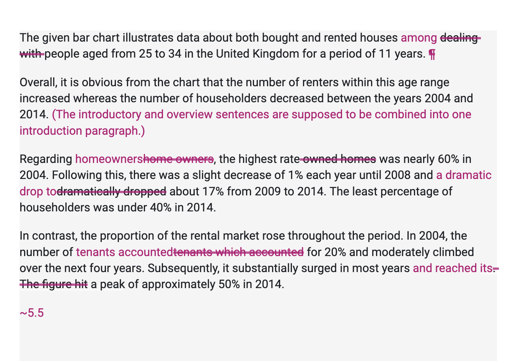

#### Tips

- Know exactly what you need to do for each question type
- Make sure you understand letter writing format
- Use a neutral semi-formal tone
- Make sure you include an overview
#### Assessment Criteria

- Task Achievement
- Coherence and Cohesion
- Lexical Resource
- Grammatical Range and Accuracy

See also: https://www.youtube.com/watch?v=dTVz0sddGT8&t=386s
#### How To Start A Writing In 2 Steps

Step 1: Analyse the chart and plan how to group the information
Step 2: Write an essay using the recommended essay structure.
	Introduction: Paraphrase task question
	Overview: Write overall trend
	Body Paragraph 1: Write about first group
	Body Paragraph 2: Write about second group

To figure out the overall trend:
1. Check if there is one category that is significantly higher overall.
2. Find those with huge value differences and those with little differences.

#### Exam Skills (page 20)

The given bar chart illustrates data about both bought and rented houses deal with people aged from 25 to 34 in the United Kingdom for a period of 11 years.
Overall, it is obvious from the chart that the number of renters within this age range increased whereas the number of householders decreased between the years 2004 and 2014.

Regarding home owners, the highest rate owned homes was nearly 60% in 2004. Following this, there was a slight decrease of 1% each year until 2008 and dramatically dropped about 17% from 2009 to 2014. The least percentage of householders was under 40% in 2014.

In contrast, the proportion of the rental market rose throughout the period. In 2004, the number of tenants which accounted for 20% and
moderately climbed over the next four years. Subsequently, it substantially surged in most years. The figure hit a peak of approximately 50% in 2014.

Overall:
	Home owners decrease
	Renters increase
Group 1: Home Owners
- 2004 ~ 60%
- 2004 - 2008 - slightly decrease
- 2008 - 2014 - dramatically decrease
- 2014 ~ 38%

Group 2: Renters
- 2014 ~ 50%
- 2004 ~ 20%
