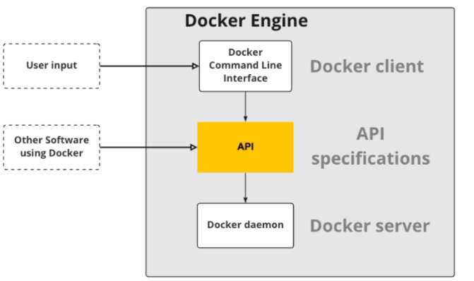
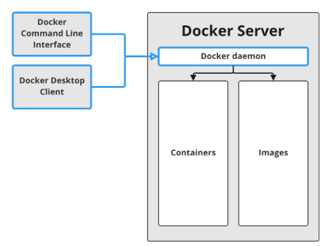
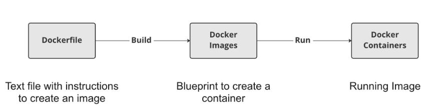

**Containers**: . A container is a portable computing environment. It contains everything needed to run a workflow or application, including dependencies, code, and configuration.
Benefits:
- Reproducible
- Portable
- Isolation
- Security and lightweight (use few extra resources comparison to running an application outside of a container)

**Docker**: Docker is an open-source tool that allows us to create, run and manage containers. Docker Compose, a tool for defining and running multi-container Docker applications, and Kubernetes, a system for container scheduling and management.

**Docker Engine** has two main parts: server and client. The client, called Docker client, is a command line interface used to talk to the server. The server is a background process that requires no user interaction, which is called a daemon, a term we will encounter repeatedly to reference the Docker server


**The Docker daemon** is responsible for managing all Docker objects, such as images, containers, and more. However, we can't directly tell the daemon what to do; we need a client to give us a human-usable interface to it.

**Images and Containers**: The daemon manages both images and containers, but there is a difference between them. While an image is a blueprint or recipe, like an idle copy of a hard drive with all the software we want to run, a container is a running image, like a copy of that same hard drive plugged into a running computer

**Containers vs Virtual Machines**: The key difference between containers and virtual machines is that virtual machines virtualize the entire machine down to the hardware. Whereas with containers, their virtualization happens in a software layer above the operating system level

| Usage Container                | Command                                             |
| ------------------------------ | --------------------------------------------------- |
| Start a container              | docker run --name `<container-name>` `<image name>` |
| Start an interactive container | docker run -it `<image name>`                       |
| Start a detached container     | docker run -d `<image name>`                        |
| List running containers        | docker ps                                           |
| Stop a container               | docker stop `<container-id>`                        |
| Filtering running containers   | docker ps -f "name=`<container-name>`"              |
| Docker logs                    | docker logs -f `<container-id>`                     |
| Cleaning up                    | docker rm `<container-id>`                          |

| Usage Image                           | Command                                                                                                                                         |
| ------------------------------------- | ----------------------------------------------------------------------------------------------------------------------------------------------- |
| Pull an image with a specific version | docker pull `<image-name>:<image- version>`                                                                                                     |
| List all local images                 | docker images                                                                                                                                   |
| Name an image                         | docker tag `<old-name> <new-name>`<br><br>`<registry-url>/<image-name>:<version>`<br><br>e.g. `docker tag spam:v1 docker.mycompany.com/spam:v1` |
| Push an image                         | docker image push `<image-name>`                                                                                                                |
| Save an image as files                | docker save -o image.tar classify_spam:v1<br>Load an image: docker load -i image.tar                                                            |
| Remove an image                       | docker image rm `<image-name>`                                                                                                                  |
| Remove all stopped containers         | docker container prune                                                                                                                          |
| Remove all images                     | docker image prune -a                                                                                                                           |
#### Creating images with Dockerfiles


| Usage                                                              | Dockerfile instruction                           |
| ------------------------------------------------------------------ | ------------------------------------------------ |
| Start a Dockerfile from an image                                   | FROM `<image-name>`                              |
| Add a shell command to image<br>                                   | RUN `<valid-shell-command>`                      |
| Copies files from local machine into the image                     | COPY `<src-path-on-host>` `<dest-path-on-image>` |
| Add a shell command run when a container is started from the image | CMD `<shell-command>`                            |
| Change the current working directory                               | WORKDIR `<path>`                                 |
| Change the current user<br>                                        | USER `<username>`                                |
| Create a variable accessible only during the build                 | ARG `<var_name>=<var_value>`                     |
| Create a variable in Dockerfile and could be used at runtime       | ENV `<var_name>=<var_value>`<br>                 |

| Usage                                                                | Shell command                                              |
| -------------------------------------------------------------------- | ---------------------------------------------------------- |
| Build image from Dockerfile<br><br>If current working directory then | docker build /location/to/Dockerfile<br><br>docker build . |
| Choose a name when building an image                                 | docker build -t image_name .                               |
| Override the CMD set in the image and run interactively              | docker run -it`<image> <shell-command>                     |
| See the instructions used to create an image                         | docker history `<image_name>`                              |

Instead of copying files from a local directory, files are often downloaded in the image build:
	 Download a file: `RUN curl <file-url> -o <destination>`
	 Unzip the file: `RUN unzip <dest-folder>/<filename>.zip`
	 Remove the original zip file: `RUN rm <copy_directoty>/<filename>.zip`

Change the startup behavior with **WORKDIR**
- Instead of using the full path: `CMD /home/repl/project/start.sh`
- Set the WORKDIR:
	- `WORKDIR /home/repl/project`
	- `CMD start.sh`
	- Overriding command will also be run in WORKDIR: `docker run -it pipeline_image start.sh`

Changing the user in an image:
 - Best practice: Don't run everything as root
```Dockerfile
FROM ubuntu                  # --> User is set to Root by default
RUN apt-get update
RUN apt-get install python3

USER repl                   # --> switch the user after installing
CMD python3 pipeline.py     # --> Run as repl

# Could be checked via `whoami` command within the shell.
```

Use-cases for the ARG instruction:
- Setting Python version:
```Dockerfile
FROM ubuntu

ARG py_version=3.9.7-1+bionic1
ARG project_folder=/project/pipeline_v3

RUN apt-get install python3=$py_version
RUN apt-get install python3-dev=$py_version
COPY /local/project/files $project_folder
```
-  Setting ARG variable at build time: `docker build --build-arg project_folder=/project/pipeline_v2 .` (ARG is overwritten, and files end up in new path)

Setting or replacing a variable at runtime: `docker run --env <key>=<value> <image_name>`
Secrets in variables are not secure and could be displayed: `docker history <image_name>`