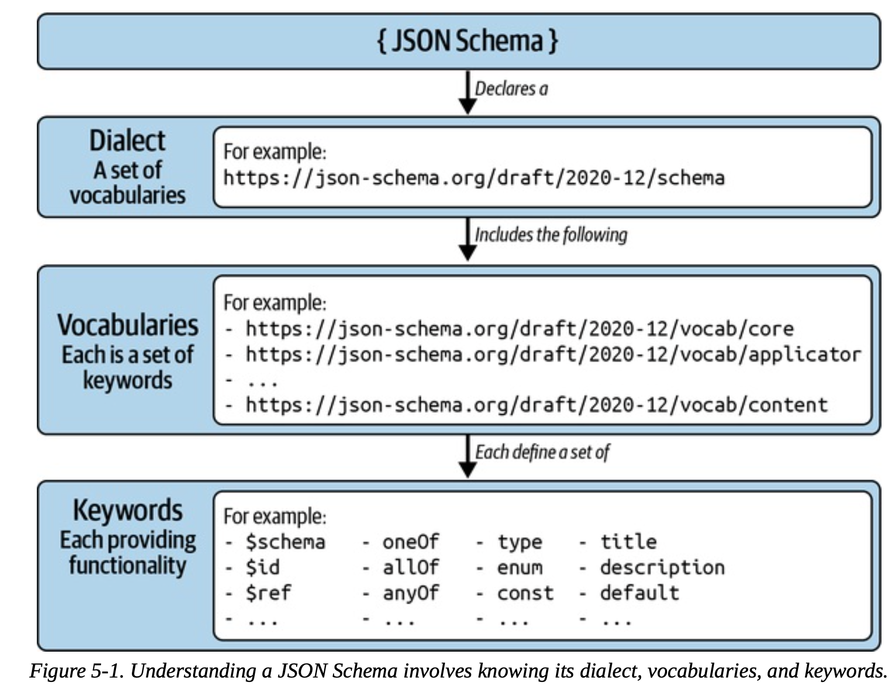

https://www.learnjsonschema.com/2020-12/
https://json-schema.org
https://github.com/Intelligence-AI/unify101/tree/main/schemas
https://jsonoid-web.fly.dev/
https://rjsf-team.github.io/react-jsonschema-form/docs/quickstart

### The Art of Alignment
Many organizations fail to achieve effective alignment due to the illusion of communication. Just because people are talking to each other doesn’t mean they are communicating or collaborating effectively, just as collecting a lot of data doesn’t mean an organization is data driven. Effective communication is not just about talking or sharing information—it’s about ensuring that messages are **clear, understood, and unambiguous.**
## What Is JSON Schema?

JSON Schema is a set of specifications that introduce a declarative language to define the structure and meaning of JSON documents, referred to as instances. This language is a general-purpose tool to talk about data across a wide variety of use cases from generative property testing to UI generation, data semantics, databases, and more. Due to the popularity of JSON as a universal data format, JSON Schema became the industry standard for validating and describing data.
### What Is a Schema?
A schema is a formal definition of a data structure that carries information about its syntax (what the data structure looks like) and its semantics (what the data means).

As its name implies, JSON Schema is a standard schema language for JSON- based data structures. A JSON document that is a valid JSON Schema is called a schema. These schemas utilize a wide range of keywords to add meaning to the JSON instances they are meant to describe.

Here is an example JSON Schema that describes object instances that define a name string property and an age positive integer property:

```json
{
  "$id": "https://example.com/my-schema",
  "$schema": "https://json-schema.org/draft/2020-12/schema",
  "type": "object",
  "required": [ "name", "age" ],
  "properties": {
    "name": { "type": "string" },
    "age": { "type": "integer", "minimum": 0 }
  }
}
```

Here is an example JSON instance that is valid according to the preceding schema:
```js
{ "name": "Tony Hoare", "age": 89 }
```

JSON Schema language is defined on top of a small set of foundational concepts: dialects, vocabularies, and meta-schemas.
#### Vocabularies and Dialects
The JSON Schema specifications define a rich set of keywords for different use cases. The JSON Schema keywords we used in the previous example are `$id`, `$schema`, type, `required`, `properties`, and `minimum`. As the number of keywords defined in the specifications grew, they were split into groups of interrelated keywords called vocabularies. In JSON Schema parlance, a collection of vocabularies is referred to as a dialect.

So far, every revision of the JSON Schema specification comes with an official dialect. The latest JSON Schema dialect at the time of this writing, which we cover in this book, is codenamed **2020-12**.
#### Meta-Schemas: Schemas That Describe Other Schemas
JSON Schema is so expressive that it is capable of describing itself, and this is by design. The idea of a JSON Schema that describes and validates itself or another JSON Schema is called a meta-schema. Meta-schemas play a key role in the versioning strategy of JSON Schema: every release of JSON Schema comes with a new official meta-schema.

This is an example of a JSON Schema that sets its meta-schema to https://json- schema.org/draft/2020-12/schema 
Declaring the `$schema` keyword is the most common way for JSON Schema implementations to know which dialect of JSON Schema a given schema is referring to.
We know https://json-schema.org/draft/2020-12/schema is the official meta-schema of the 2020-12 dialect, so the preceding schema is essentially saying, “I am described by the schema that models 2020-12 schemas.”
### Understanding JSON Schemas

Reading a JSON Schema is no different from reading a piece of code. To know what the code means, you have to step through it, checking the external dependencies it consumes and the functions it invokes. Similarly, to understand a JSON Schema, you must determine the dialect in use, the vocabularies being used, and the keywords it declares.



#### Step 1: Determining the Schema Dialect: The $schema Keyword
The first step to understand a JSON Schema is to determine the dialect in use— in other words, the vocabularies that the schema is using. Without knowing its dialect, the keywords declared by a JSON Schema are literally meaningless; a JSON Schema implementation will silently ignore unrecognized keywords.
```json
{
  "$schema": "https://json-schema.org/draft/2020-12/schema"
}
```
This is the URI of the official meta-schema for the 2020-12 dialect, so we know that our schema uses the JSON Schema 2020-12 dialect. You can check the vocabularies imported by a dialect by looking at the `$vocabulary` keyword defined in its meta-schema.
```json
{
    "$vocabulary": {
        "https://json-schema.org/draft/2020-12/vocab/core": true,
        "https://json-schema.org/draft/2020-12/vocab/applicator": true,
        "https://json-schema.org/draft/2020-12/vocab/unevaluated": true,
        "https://json-schema.org/draft/2020-12/vocab/validation": true,
        "https://json-schema.org/draft/2020-12/vocab/meta-data": true,
        "https://json-schema.org/draft/2020-12/vocab/format-annotation": true,
        "https://json-schema.org/draft/2020-12/vocab/content": true
    }
```

#### Step 2: Determining the Schema Vocabularies
At this point, we know that our JSON Schema uses the 2020-12 dialect. However, we still don’t know which vocabularies it uses. To determine this, we need to fetch the meta-schema through its URI and take a look at its `$vocabulary` keyword.
The `$vocabulary` keyword is a JSON object whose keys are vocabulary URIs and whose values are Booleans that determine whether the corresponding vocabulary is considered to be required (true) or optional (false). A JSON Schema implementation will abort processing if it encounters a required vocabulary that it doesn’t know about and understand.
In this case, we know that our JSON Schema imports the vocabularies above, marking them all as required.
#### Step 3: Understanding Schema Vocabularies
For official vocabularies (hosted at https://json-schema.org), you can consult [Learn JSON Schema](https://www.learnjsonschema.com/2020-12/), a website that presents concise reference documentation for JSON Schema dialects and vocabularies.
#### Step 4: Understanding Schema Keywords
**Core Vocabulary**: introduces foundational keywords that are essential for processing any JSON Schema.
`$schema, $id, $ref, $defs, $comment, $anchor, $vocabulary, ...`

**Validation Vocabulary:** This vocabulary introduces a rich set of keywords for asserting the structure and contents of JSON instances. These keywords constrain the possible JSON instances that successfully validate against the schema. 
`type, enum, const, minLength, maxLength, ....`

**Application Vocabulary:** introduces a set of keywords that combine other nested JSON Schemas in a variety of ways. Applicators are the key feature behind the expressiveness of the language and are considered to be the bread and butter of JSON Schema
`oneOf, allOf, anyOf, if, then, else, not, properties, patternProperties, additionalProperties, items, contains`

### Referencing Schemas
As with traditional programming languages, schemas are more maintainable if they reuse existing schemas rather than reinvent the wheel. For example, you may write a schema that introduces the concept of a person. If other schemas also involve people, you’d rather reuse the same person definition instead of duplicating it in every one of your schemas.

Consider a JSON Schema that describes objects whose `foo`, `bar`, and `baz` properties are even integers:
```json
{
  "$id": "https://example.com/schema-with-duplication",
  "$schema": "https://json-schema.org/draft/2020-12/schema",
  "type": "object",
  "properties": {
    "foo": { "type": "integer", "multipleOf": 2 },
    "bar": { "type": "integer", "multipleOf": 2 },
    "baz": { "type": "integer", "multipleOf": 2 }
   } 
}
```

Though this schema does the job, it duplicates the concept of an even integer multiple times, once for each property. Although this example is contrived, real- world schemas often duplicate complex subschemas that are tens of lines each.
#### Local referencing
One way of keeping the schema tidy is to move the shared definition of an even integer to a common location through the use of the **`$defs`** keyword and then reference it through the **`$ref`** keyword every time it’s needed.
Here is a revised version of the JSON Schema from the previous section, this time making use of local referencing to reduce duplication:
```json
{
  "$id": "https://example.com/local-referencing",
  "$schema": "https://json-schema.org/draft/2020-12/schema",
  "type": "object",
  "properties": {

    "foo": { "$ref": "#/$defs/even-integer" },
    "bar": { "$ref": "#/$defs/even-integer" },
    "baz": { "$ref": "#/$defs/even-integer" }
   }, 
   "$defs": {
	   "even-integer": {
	      "type": "integer", "multipleOf": 2
	   }
   }
}
```
In this example, we used the $defs keyword to define a shared entity called even-integer. Once this new entity is defined, we can reference it from anywhere in the schema through the $ref keyword. The curious syntax for referencing the even-integer schema comes from JSON Pointer, a standard for expressing navigation of JSON documents.
#### Remote referencing
Local referencing helps keep schemas clean when you need to reuse definitions from within a single schema, but what happens if multiple schemas, potentially written by different authors, need to reuse our even integer description?
Remote referencing is about extracting shared definitions as independent standalone schemas and referencing them by their respective URIs. Note that JSON Schema is agnostic about how URIs are resolved. Most JSON Schema implementations provide a way to create an in-memory registry that associates URIs with schemas.
Let’s start by extracting our even integer definition into its own schema. We will pretend to deploy this schema at https://example.com/even-integer, so we will set the `$id` keyword accordingly:

```json
{
  "$id": "https://example.com/even-integer",
  "$schema": "https://json-schema.org/draft/2020-12/schema",
  "type": "integer",
  "multipleOf": 2
}
```
Assuming our even integer schema is accessible via its declared URI, we can update the schema from the previous section to point at the definition of even integers using this new schema rather than its local definition:
```json
{
  "$id": "https://example.com/remote-referencing",
  "$schema": "https://json-schema.org/draft/2020-12/schema",
  "type": "object",
  "properties": {

    "foo": { "$ref": "https://example.com/even-integer" },
    "bar": { "$ref": "https://example.com/even-integer" },
    "baz": { "$ref": "https://example.com/even-integer" }
} }
```
This revised version of the schema uses remote referencing to import the even integer schema. When a JSON Schema implementation starts processing this schema, it will attempt to locate the even integer schema from its URI (based on how the implementation is configured to retrieve external schemas) and use its definition in the respective locations.
#### Writing a Schema: Step by Step
Let’s use JSON Schema to describe product entry JSON instances like the previous one.
The first thing we’ll do is create a JSON Schema that declares the `$schema` keyword to make use of the 2020-12 dialect official meta-schema, and uses the title keyword to give it a human-readable name:
```json
{
  "$schema": "https://json-schema.org/draft/2020-12/schema",
  "title": "A Intelligence.AI product entry"
}
```

Let’s describe product titles and descriptions. For this, we will use the properties keyword, in conjunction with the type keyword:
```json
{
  "$schema": "https://json-schema.org/draft/2020-12/schema",
  "title": "A Intelligence.AI product entry",
  "type": "object",
  "properties": {
    "title": { "type": "string" },
    "description": { "type": "string" }
  }
}
```
Product prices are numbers. We don’t want to sell any products for free, so product prices must be greater than zero, a constraint we can express using the exclusiveMinimum keyword:

```json
{
  "$schema": "https://json-schema.org/draft/2020-12/schema",
  "title": "A Intelligence.AI product entry",
  "type": "object",
  "properties": {
    "title": { "type": "string" },
    "description": { "type": "string" },
	"price": { "type": "number", "exclusiveMinimum": 0 }
  }
}
```
We can express the price currency as an enumeration of possible currency codes using the enum keyword. We plan to sell our beans in the US and in the UK, so we will support USD and GBP currency codes:

```json
{
  "$schema": "https://json-schema.org/draft/2020-12/schema",
  "title": "A Intelligence.AI product entry",
  "type": "object",
  "properties": {
    "title": { "type": "string" },
    "description": { "type": "string" },
	"price": { "type": "number", "exclusiveMinimum": 0 },
	"currency": { "enum": [ "USD", "GBP" ] }
  }
}
```
> When using the enum keyword, the type keyword is not needed. That is because enum will only accept one of its declared values and nothing else, making their types implicit.

The product URL and the image URL are strings. However, we can further signify that these strings represent URIs using the format keyword.

```json
{
  "$schema": "https://json-schema.org/draft/2020-12/schema",
  "title": "A Intelligence.AI product entry",
  "type": "object",
  "properties": {
    "title": { "type": "string" },
    "description": { "type": "string" },
	"price": { "type": "number", "exclusiveMinimum": 0 },
	"url": { "type": "string", "format": "uri" },
    "image_url": { "type": "string", "format": "uri" }
  }
}
```
JSON does not have a built-in timestamp data type. The convention is to store timestamps as strings and further annotate them using the format keyword, like we did for URLs:
```json
{
  "$schema": "https://json-schema.org/draft/2020-12/schema",
  "title": "A Intelligence.AI product entry",
  "type": "object",
  "properties": {
    "title": { "type": "string" },
    "description": { "type": "string" },
	"price": { "type": "number", "exclusiveMinimum": 0 },
	"url": { "type": "string", "format": "uri" },
    "image_url": { "type": "string", "format": "uri" },
    "timestamp": { "type": "string", "format": "date-time" }
  }
}
```
The only missing property is the product SKU. We can define this property using a regular expression that constrains the values to strings starting with SHBH followed by five digits using the pattern keyword:

```json
{
  "$schema": "https://json-schema.org/draft/2020-12/schema",
  "title": "A Intelligence.AI product entry",
  "type": "object",
  "properties": {
    "title": { "type": "string" },
    "description": { "type": "string" },
	"price": { "type": "number", "exclusiveMinimum": 0 },
	"url": { "type": "string", "format": "uri" },
    "image_url": { "type": "string", "format": "uri" },
    "timestamp": { "type": "string", "format": "date-time" },
	"sku": { "type": "string", "pattern": "^SHBH\\d{5}$" }
  }
}
```
Finally, JSON Schema permits object properties not covered by the properties keyword by default. For example, our schema will allow a discount property to be present, even though we never defined it. We can prevent additional properties by declaring the additionalProperties keyword as false:
```json
{

  "$schema": "https://json-schema.org/draft/2020-12/schema",
  "title": "An Intelligence.AI product entry",
  "type": "object",
  "additionalProperties": false,
  "required": [ "title", "description", "price", "currency",
                "url", "image_url", "timestamp", "sku" ],
  "properties": {
    "title": { "type": "string" },
    "description": { "type": "string" },
    "price": { "type": "number", "exclusiveMinimum": 0 },
    "currency": { "enum": [ "USD", "GBP" ] },
    "url": { "type": "string", "format": "uri" },
    "image_url": { "type": "string", "format": "uri" },
    "timestamp": { "type": "string", "format": "date-time" },
    "sku": { "type": "string", "pattern": "^SHBH\\d{5}$" }
} }
```

### JSON Schema as a Constraints Language

To make the best use of JSON Schema, it’s important to understand that it is not a modeling language, but a constraints language. While this distinction is subtle, it has philosophical ramifications that result in unexpected behavior for the unaware.


