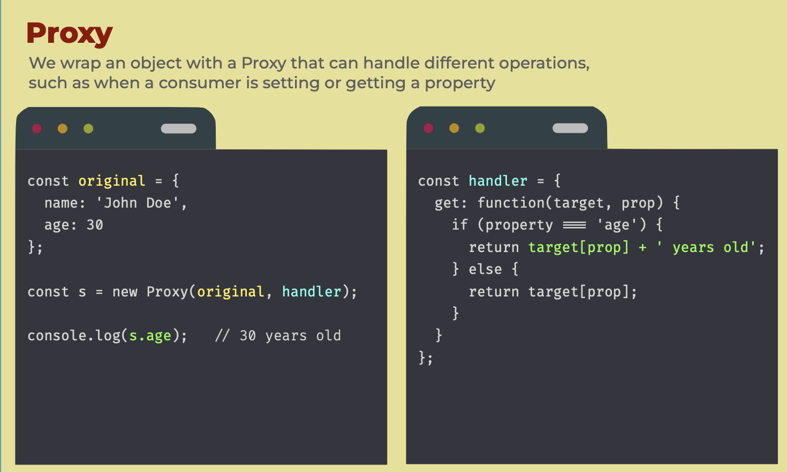

A wrapper object that lets you intercept and modify operations performed on the wrapped object, allowing you to add custom behavior or validation to the object's properties and methods.
We can use a proxy for validation, data binding and reactive programming.



The syntax:

```ts
let proxy = new Proxy(target, handler);
```

- `target` – is an object to wrap, can be anything, including functions.
- `handler` – proxy configuration: an object with “traps”, methods that intercept operations. – e.g. `get` trap for reading a property of `target`, `set` trap for writing a property into `target`, and so on.

`Proxy` is a special “exotic object”. It doesn’t have own properties. With an empty `handler` it transparently forwards operations to `target`.

For most operations on objects, there’s a so-called “internal method” in the JavaScript specification that describes how it works at the lowest level. For instance `[[Get]]`, the internal method to read a property, `[[Set]]`, the internal method to write a property, and so on. These methods are only used in the specification, we can’t call them directly by name.

Proxy traps intercept invocations of these methods. They are listed in the [Proxy specification](https://tc39.es/ecma262/#sec-proxy-object-internal-methods-and-internal-slots) and in the table below.

For every internal method, there’s a trap in this table: the name of the method that we can add to the `handler` parameter of `new Proxy` to intercept the operation:

| Internal Method         | Handler Method             | Triggers when…                                                                                                                                                                                                                                                                                                                    |
| ----------------------- | -------------------------- | --------------------------------------------------------------------------------------------------------------------------------------------------------------------------------------------------------------------------------------------------------------------------------------------------------------------------------- |
| `[[Get]]`               | `get`                      | reading a property                                                                                                                                                                                                                                                                                                                |
| `[[Set]]`               | `set`                      | writing to a property                                                                                                                                                                                                                                                                                                             |
| `[[HasProperty]]`       | `has`                      | `in` operator                                                                                                                                                                                                                                                                                                                     |
| `[[Delete]]`            | `deleteProperty`           | `delete` operator                                                                                                                                                                                                                                                                                                                 |
| `[[Call]]`              | `apply`                    | function call                                                                                                                                                                                                                                                                                                                     |
| `[[Construct]]`         | `construct`                | `new` operator                                                                                                                                                                                                                                                                                                                    |
| `[[GetPrototypeOf]]`    | `getPrototypeOf`           | [Object.getPrototypeOf](https://developer.mozilla.org/en-US/docs/Web/JavaScript/Reference/Global_Objects/Object/getPrototypeOf)                                                                                                                                                                                                   |
| `[[SetPrototypeOf]]`    | `setPrototypeOf`           | [Object.setPrototypeOf](https://developer.mozilla.org/en-US/docs/Web/JavaScript/Reference/Global_Objects/Object/setPrototypeOf)                                                                                                                                                                                                   |
| `[[IsExtensible]]`      | `isExtensible`             | [Object.isExtensible](https://developer.mozilla.org/en-US/docs/Web/JavaScript/Reference/Global_Objects/Object/isExtensible)                                                                                                                                                                                                       |
| `[[PreventExtensions]]` | `preventExtensions`        | [Object.preventExtensions](https://developer.mozilla.org/en-US/docs/Web/JavaScript/Reference/Global_Objects/Object/preventExtensions)                                                                                                                                                                                             |
| `[[DefineOwnProperty]]` | `defineProperty`           | [Object.defineProperty](https://developer.mozilla.org/en-US/docs/Web/JavaScript/Reference/Global_Objects/Object/defineProperty), [Object.defineProperties](https://developer.mozilla.org/en-US/docs/Web/JavaScript/Reference/Global_Objects/Object/defineProperties)                                                              |
| `[[GetOwnProperty]]`    | `getOwnPropertyDescriptor` | [Object.getOwnPropertyDescriptor](https://developer.mozilla.org/en-US/docs/Web/JavaScript/Reference/Global_Objects/Object/getOwnPropertyDescriptor), `for..in`, `Object.keys/values/entries`                                                                                                                                      |
| `[[OwnPropertyKeys]]`   | `ownKeys`                  | [Object.getOwnPropertyNames](https://developer.mozilla.org/en-US/docs/Web/JavaScript/Reference/Global_Objects/Object/getOwnPropertyNames), [Object.getOwnPropertySymbols](https://developer.mozilla.org/en-US/docs/Web/JavaScript/Reference/Global_Objects/Object/getOwnPropertySymbols), `for..in`, `Object.keys/values/entries` |

> :memo: **Notes** 
> JavaScript enforces some invariants – conditions that must be fulfilled by internal methods and traps.
> Most of them are for return values:
> - `[[Set]]` must return `true` if the value was written successfully, otherwise `false`.
> - `[[Delete]]` must return `true` if the value was deleted successfully, otherwise `false`.


The [Reflect](https://developer.mozilla.org/en-US/docs/Web/JavaScript/Reference/Global_Objects/Reflect) API is designed to complement [Proxy](https://developer.mozilla.org/en-US/docs/Web/JavaScript/Reference/Global_Objects/Proxy). For any `Proxy` trap, there’s a `Reflect` call with same arguments. We should use those to forward calls to target objects.

Proxies have some limitations:
- Built-in objects have “internal slots”, access to those can’t be proxied. See the workaround above.
- The same holds true for private class fields, as they are internally implemented using slots. So proxied method calls must have the target object as `this` to access them.
- Object equality tests `===` can’t be intercepted.
- Performance: benchmarks depend on an engine, but generally accessing a property using a simplest proxy takes a few times longer. In practice that only matters for some “bottleneck” objects though

#### Example

```js
// Using both legacy and new properties but getting warning in terms of using legacy.

const legacyFontSizes = {
  extraLarge: 'gigantic', // deprecated
  extraSmall: 'tiny', // deprecated

  extraLarge: {
    replacementName: 'gigantic',
    replacementValue: 'gigantic',
  },
  extraSmall: {
    replacementName: 'tiny',
    replacementValue: 'tiny',
  },
};

const fontSizes = {
  gigantic: 'gigantic',
  large: 'large',
  medium: 'medium',
  small: 'small',
  tiny: 'tiny',
};

const proxiedOptions = {
  get(target, propName, receiver) {
    if (propName in legacyFontSizes) {
      const legacyProp = legacyFontSizes[propName];

      console.warn(`${propName} is deprecated.`, `Use ${legacyProp.replacementName} instead.`);
      return legacyProp.replacementValue;
    }

    return Reflect.get(target, propName, receiver);
  },
};

const proxiedFontSizes = new Proxy(fontSizes, proxiedOptions);

// proxiedFontSizes.extraSmall
// proxiedFontSizes.tiny
```

```js
// A proxy that throws an error for an attempt to read of a non-existent property instead.

let user = {
  name: "John"
};

function wrap(target) {
  return new Proxy(target, {
    get(target, prop, receiver) {
      if (prop in target) {
        return Reflect.get(target, prop, receiver);
      } else {
        throw new ReferenceError(`Property doesn't exist: "${prop}"`)
      }
    }
  });
}

user = wrap(user);

alert(user.name); // John
alert(user.age); // ReferenceError: Property doesn't exist: "age"
```


### TODO:
https://humanwhocodes.com/blog/2014/04/22/creating-defensive-objects-with-es6-proxies/
https://humanwhocodes.com/blog/2014/04/29/creating-type-safe-properties-with-ecmascript-6-proxies/