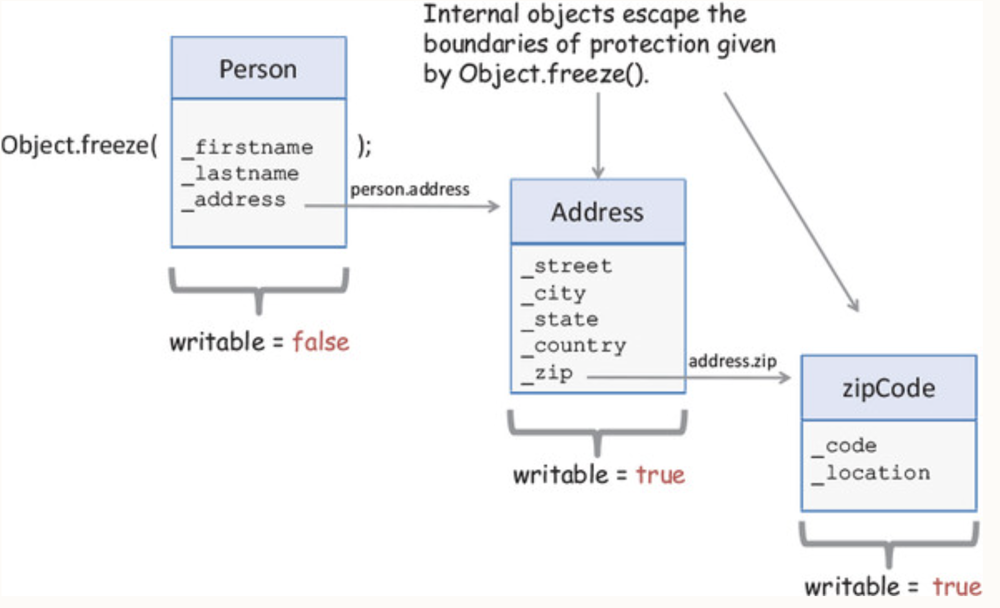
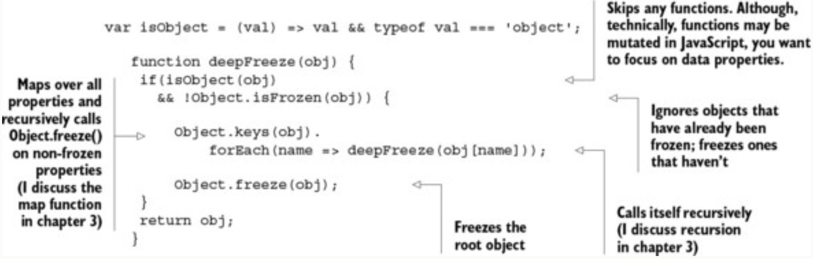
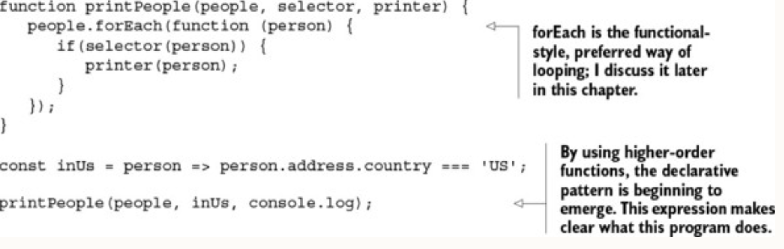
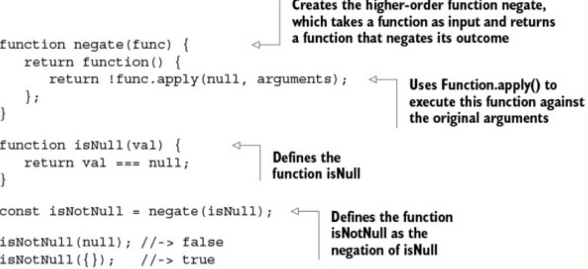
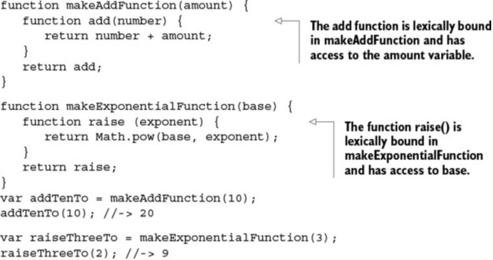

_This chapter covers_

- Why JavaScript is a suitable functional language
- JavaScript as a language that enables multiparadigm development
- Immutability and policies for change
- Understanding higher-order and first-class functions
- Exploring the concepts of closures and scopes
- Practical use of closures

 The focus of OOP is to create inheritance hierarchies (such as Student from Parent) with methods and data tightly bound together. Functional programming, on the other hand, favors general polymorphic functions that crosscut different data types and avoid the use of **this**.

 In essence, what inheritance does for OOP, composition does for FP in terms of applying new behavior to different data types.

|  | Functional | Object-oriented |
| ---- | ---- | ---- |
| **Unit of composition** | Functions | Objects (classes) |
| **Programming style** | Declarative | Imperative |
| **Data and behavior** | Loosely coupled into pure, standalone functions | Tightly coupled in classes with methods |
| **State management** | Treats objects as immutable values | Favors mutation of objects via instance methods |
| **Control flow** | Functions and recursion | Loops and conditionals |
| **Thread safety** | Enables concurrent programming | Difficult to achieve |
| **Encapsulation** | Not needed because everything is immutable | Needed to protect data integrity |
#### Managing the state of JavaScript objects

The _state_ of a program can be defined as a snapshot of the data stored in all of its objects at any moment in time. Sadly, JavaScript is one of the worst languages when it comes to securing an object’s state. A JavaScript object is highly dynamic, and you can modify, add, or delete its properties at any point in time.

While immutability is my favorite technique to avoid aliasing bugs, it's also possible to avoid them by ensuring assignments always make a copy
##### Value Objects

Value Object pattern is a design pattern used to represent immutable objects that encapsulate a set of values or data. Unlike regular objects in JavaScript, which can be modified, Value Objects are immutable and provide methods for accessing and manipulating their internal state.

```ts
class Point {
	constructor(x, y) {
		this._x = x;
		this._y = y;
	}

	get x() {
		return this._x;
	}

	get y() {
		return this._y;
	}

  // Method for calculating the distance between two points
  distanceTo(otherPoint) {
    const dx = this._x - otherPoint.x;
    const dy = this._y - otherPoint.y;
    return Math.sqrt(dx * dx + dy * dy);
  }

// Override toString method for better logging or debugging
	toString() {
		return `(${this._x}, ${this._y})`;
	}
}

// Example usage
const pointA = new Point(3, 4);
const pointB = new Point(6, 8);

console.log(pointA.toString()); // Output: (3, 4)
console.log(pointA.distanceTo(pointB)); // Output: 5
```

In the example above, **Point** is a Value Object representing a 2D point with x and y coordinates. The `x` and `y` properties are read-only. By encapsulating the state of the point and providing methods to work with it, the `Point` object becomes immutable and guarantees that its internal state cannot be modified once created. This ensures that the object's values remain consistent throughout its lifetime.
##### Reference Objects

The Reference Object pattern is not a widely recognized design pattern. Objects are typically passed by reference. This means that when you assign an object to a variable or pass it as a function argument, you are actually working with a reference to the object rather than a direct copy of the object's data.

```ts
const object1 = { value: 10 };
const object2 = object1;

object2.value = 20; // Modifying object2 also effects object1

console.log(object1.value) // Output: 20
```


Value Object is an object-oriented design pattern that was inspired by functional programming. This pattern is ideal, but it’s not enough for modeling entire real-world problem domains. In practice, it’s likely your code will need to handle hierarchical data (as you saw with Person and Student earlier) as well as interact with legacy objects. Luckily, JavaScript has a mechanism to emulate this using with Object.freeze.

```ts
const person = Object.freeze(new Person('Haskell', 'Curry'));

person.firstname = 'Bob' // Not allowed 🚫
```

`Object.freeze()` can also immobilize inherited attributes. So freezing an instance of Student works exactly the same way and follows the object’s prototype chain protecting every inherited Person attribute. But it can’t be used to freeze nested object attributes.



Although the Person type has been frozen, its internal object properties (like `_address`) haven’t. So `person.address.country` is eligible to be changed at any time. Because only the top-level variables are frozen, this is a shallow freeze.
`Object.freeze()` is a shallow operation. To get around this, you need to manually freeze an object’s nested structure.



Next, I discuss the best alternative to centrally managing object changes immutably using a functional approach called _lenses_.

#### Navigating and modifying object graphs with lenses

 You need a solution for mutating stateful objects, in an immutable manner, that’s unobtrusive and doesn’t require hardcoding boilerplate code everywhere. **_Lenses_**, also known as _functional references_, are functional programming’s solution to accessing and immutably manipulating attributes of stateful data types. Internally, lenses work similarly to a copy-on-write strategy by using an internal storage component that knows how to properly manage and copy state.
 
By default, Ramda exposes all of its functionality via the global object R. Using `R.lensProp`, you can create a lens that wraps over the `lastname` property of Person:

```ts
var person = new Person('Alonzo', 'Church', '444-44-4444');
const lastnameLens = R.lenseProp('lastname');

const newPerson = R.set(lastnameLens, 'Mourning', person);

// You can use R.view to read the contents of this property:
R.view(lastnameLens, person); //-> 'Church'
```

Now you have getter and setter semantics in a functional way. **Lenses** also fit extremely well with FP’s philosophy of isolating field-access logic away from the object, eliminating the reliance on this, and giving you powerful functions that know how to reach into and manipulate the contents of any object.
#### Functions

We can distinguish between _expressions_ (functions that produce a value) and _statements_ (functions that don’t). Imperative and procedural programming are mostly made up of ordered sequences of statements; but FP is entirely expressional, so void functions don’t serve a purpose in this paradigm.

JavaScript functions have two important characteristics that are the bread and butter of its functional style: they’re first-class and higher-order.

In JavaScript, the term _first-class_ comes from making functions actual objects in the language—also called first-class citizens. You’re probably used to seeing functions declared like this:

```ts
function multiplier(a, b) {
	return a * b;
}
```

#### Higher-order functions
Because functions behave like regular objects, you can intuitively expect that they can be passed in as function arguments and returned from other functions. These are called _higher-order functions_

```ts
function applyOperation(a, b, opt) {
	opt(a, b);
}

const multiplier = (a, b) => {
	return a * b;
}
applyOperation(2, 3 multiplier); // Output: 6
```

 Functions are considered "first-class citizens" or "first-class objects," which means that functions are treated as values and can be assigned to variables, passed as arguments to other functions, and returned as values from other functions.

Because functions are first-class and higher-order, JavaScript functions can _behave as values_, which implies that a function is nothing more than a yet-to-be-executed value defined immutably based on the input provided to the function. This principle is embedded in everything that you do in functional programming, especially when you get into function chains, as you’ll see in [chapter 3](https://learning.oreilly.com/library/view/functional-programming-in/9781617292828/kindle_split_011.html#ch03). When building function chains, you’ll always rely on function names to point to a piece of a program that will be executed as part of an entire expression.

**A noticeable pattern** that occurs in languages like JavaScript is that function names can be **passive nouns** like multiplier, comparator, and action. Because they’re first-class, functions can be assigned to variables and executed at a later time. Let’s refactor printPeople to take full advantage of higher-order functions:



#### Function methods

JavaScript supports calling functions via the function methods (like meta-functions) `call` and `apply`, which belong to the function’s prototype. Both methods are used extensively when scaffolding code is built so that API users can create new functions from existing ones.



```ts
Function.prototype.apply(thisArg, [argsArray])

Function.prototype.call(thisArg, arg1,arg2,...)
```

If `thisArg` refers to an object, it’s set to the object the method is called on. If `thisArg` is null, the function context is set to the global object, and the function behaves like a simple global function. But if the method is a function in strict mode, the actual value of null is passed in.

Manipulating the function context through `thisArg` opens the door to many different techniques. This is discouraged in functional programming, because it never relies on the context state (recall that all data is provided to functions as arguments), so I won’t spend any more time on this feature.

Although the notion of a shared global or object context isn’t all that useful in functional JavaScript, there’s one specific context we care about: the function context. To understand it, you must understand closures and scopes.

#### Closures and scopes

Prior to JavaScript, closures only existed in FP languages used in certain specific applications. JavaScript is the first to adopt it into mainstream development and significantly change the way in which we write code.

A _closure_ is a data structure that binds a function to its environment at the moment it’s declared. It’s based on the textual location of the function declaration; therefore, a closure is also called a _static_ or _lexical scope_ surrounding the function definition. Because it gives functions access to its surrounding state, it makes code clear and readable. As you’ll see shortly, closures are instrumental not only in functional programs when you’re working with higher-order functions, but also for event-handling and callbacks, emulating private variables, and mitigating some of JavaScript’s pitfalls.

 In essence, a closure is a function’s inheritance of scopes akin to how an object’s method has access to its inherited instance variables—both have references to their parents. Closures are readily seen in the case of nested functions. Here’s a quick example:
 

