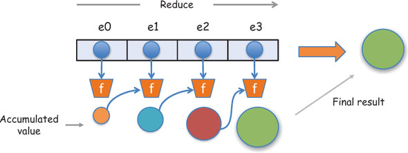
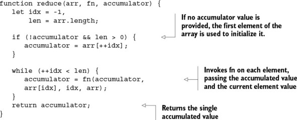
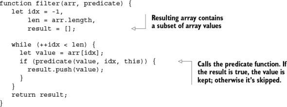

_This chapter covers_

- Understanding program control and flow
- Reasoning efficiently about code and data
- Unlocking the power of map, reduce, and filter
- Discovering the Lodash.js library and function chains
- Thinking recursively

#### Map

>The map operation applies an iterator function f to each element in an array and returns an array of equal length.

A formal definition of this operation is as follows:
`map(f, [e0, e1, e2...]) -> [r0, r1, r2...];  where, f(dn) = rn`

#### Reduce

>Reducing an array into a single value. Each iteration returns an accumulated value based on the previous result; this accumulated value is kept until you reach the end of the array. The final outcome of reduce is always a single value.

This diagram can be expressed more formally with the following notation:
`reduce(f,[e0, e1, e2, e3],accum) -> f(f(f(f(acc, e0), e1, e2, e3)))) -> R`

#### Filter

>The filter operation takes an array as input and applies a selection criteria p that potentially yields a much smaller subset of the original array. The criteria p is also known as a _function predicate_.
`

In formal notation, this looks like the following:
`filter(p, [d0, d1, d2, d3...dn]) -> [d0,d1,...dn] (subset of original input)`

