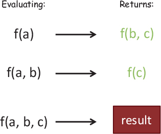
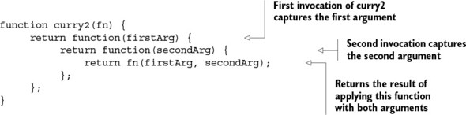
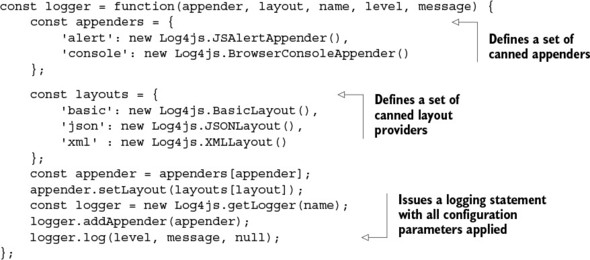
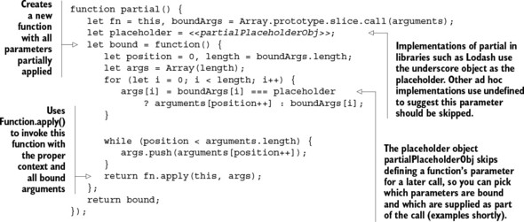
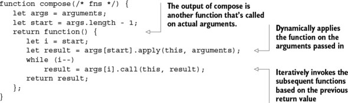

_This chapter covers_

- Comparing function chains and pipelines
- Introducing the Ramda.js functional library
- Exploring the concepts of currying, partial application, and function binding
- Creating modular programs with functional composition
- Enhancing your program’s flow with function combinators

#### Requirements for compatible functions
Object-oriented programs use pipelines sporadically, in specific scenarios (authentication/authorization is usually one of them); on the other hand, functional programming relies on pipelines as the sole method of building programs. Depending on the task at hand, there’s usually quite a gap between a problem definition and a proposed solution; therefore, computations must be carried out in well-defined stages. These stages are represented by functions that execute with the condition that their inputs and outputs be compatible in two ways:

- **Type**: The type returned by one function must match the argument type of a receiving function.

- **Arity**: A receiving function must declare at least one parameter in order to handle the value returned from a preceding function call.
##### Type-compatible functions
When designing function pipelines, it’s important that there exists a level of compatibility between what functions return and what they accept. In terms of type, this isn’t as big a concern in JavaScript as it is with statically typed languages, because JavaScript is loosely typed. Hence, if an object behaves like a certain type in practice, it’s that type. This is also known as _duck typing_: “If it walks like a duck and talks like a duck, it’s a duck.”
Types are certainly important but, in JavaScript, not as critical as being compatible with the number of arguments a function accepts.
##### Functions and arity: the case for tuples

_Arity_ can be defined as the number of arguments a function accepts; it’s also referred to as the function’s _length_. We usually take arity for granted in other programming paradigms, but in functional programming, as a corollary to referential transparency, the number of arguments a function declares is often directly proportional to its complexity. For instance, a function that works on a single string is likely much simpler than one taking three or four arguments:

```ts
// isValid :: String -> Boolean
function isValid(str) {
	...
}
=> Easy to use

// makeAsyncHttp :: String, String, Array -> Boolean
function makeAsyncHttp(method, url, data) {
	...
}
=> Harder to use, because all arguments must be computed first.
```

Pure functions that expect a single argument are the simplest to use because the implication is that they serve a single purpose—a singular responsibility. Our goal is to work with functions with as few arguments as possible, because they’re more flexible and versatile than those that depend on multiple arguments. Unfortunately, unary functions aren’t easy to come by.
But how can you return two different values? Functional languages have support for a structure called a **_tuple_**. It’s a finite, ordered list of elements, usually grouping two or three values at a time, and written (a, b, c). Based on this concept, you can use a tuple as a return value from isValid that groups a status with a possible error message, to be returned as a single entity and subsequently passed to another function if need be. Let’s explore tuples in more detail.
Tuples are immutable structures that pack together items of different types so that they can be passed into other functions. There are other ways of returning ad hoc data, such as object literals or arrays:

```ts
return {
   status : false,
   message: 'Input is too long!'
};

OR

return [false, 'Input is too long!'];
```

But when it comes to transferring data between functions, tuples offer more advantages:
- **Immutable —** Once created, you can’t change a tuple’s internal contents.
- **Avoid creating ad hoc types —** Tuples can relate values that may have no relationship at all to each other. So defining and instantiating new types solely for grouping data together makes your model unnecessarily convoluted.
- **Avoid creating heterogeneous arrays —** Working with arrays containing different types of elements is hard because it leads to writing code filled with lots of defensive type checks. Traditionally, arrays are meant to store objects of the same type.

Tuples are one way to reduce a function’s arity, but there’s a better alternative for cases in which tuples aren’t sufficient. Let’s spice things up a bit by introducing **_function currying_**, which not only abstracts arity but also encourages modularity and reusability.
##### Curried function evaluation
Passing a function’s return value as input to a unary function is straightforward, but what if the target function expects more parameters? In order to understand currying in JavaScript, first you must understand the difference between a _curried_ and a regular (non-curried) evaluation. In JavaScript, a regular or non-curried function call is permitted to execute with missing arguments. In other words, if you define a function `f(a, b, c)` and call it with just a, the evaluation proceeds, and the JavaScript runtime sets `b` and `c` to `undefined`. This is unfortunate and most likely the reason why currying isn’t a built-in feature of the language. As you can imagine, not declaring any arguments and relying on the arguments object within functions only exacerbates this issue.

>Calling a non-curried function with missing arguments causes the function to eagerly evaluate missing parameters and fill them with undefined.
>`Evaluating: f(a) -----> Runs as: f(a, undefined, undefined)`

On the other hand, a curried function is one where all arguments have been explicitly defined so that, when called with a subset of the arguments, it returns a new function that waits for the rest of the parameters to be supplied before running.


Currying is a technique that converts a multivariable function into a stepwise sequence of unary functions by suspending or “procrastinating” its execution until all arguments have been provided, which could happen later. Here’s the formal definition of a curry of three parameters:
`curry(f) :: ((a,b,c) -> d) -> a -> b -> c -> d`

Because JavaScript doesn’t automatically curry functions, you need to write some supporting code to enable this. Before we go into auto-currying, let’s start with a simple scenario of manually currying two arguments.



In particular, it can be used to implement popular design patterns:
- Emulating function interfaces
- Implementing reusable, modular function templates

#### Emulating function factories
In the object-oriented world, interfaces are abstract types used to define a contract that classes must implement. If you create an interface with the `function findStudent(ssn)`, concrete implementers of this interface must implement this function.
You can create a function that looks up student objects in a data store as well as an array (these are the two implementers):

```ts
// fetchStudentFromDb :: DB -> (String -> Student)
const fetchStudentFromDb = R.curry(function (db, ssn) {
	return find(db, ssn)
}); // Looks up in an object DB

// fetchStudentFromArray :: Array -> (String -> Student)
const fetchStudentFromArray = R.curry(function (arr, ssn) {
	return arr[ssn];
}); // Looks up in an array
```

Because the functions are curried, you can separate the function definition from evaluation with a generic factory method findStudent, whose implementation details could have originated from either implementation:

```ts
const findStudent = useDB ? fetchStudentFromDb(db) : fetchStudentFromArray(arr)

findStudent('444-44-4444');
```

Now, `findStudent` can be passed to other modules without the caller knowing the concrete implementation (this will be important in [chapter 6](https://learning.oreilly.com/library/view/functional-programming-in/9781617292828/kindle_split_015.html#ch06) for unit testing to mock interaction with the object store). In matters of reuse, currying also allows you to create a family of function templates.
#### Implementing reusable function templates

Suppose you need to configure different logging functions to handle different states in your application, such as errors, warnings, debug, and so on. Function templates define a family of related functions based on the number of arguments that are curried at the moment of creation.

There are many settings you can configure, and copying and pasting this code into each file causes lots of duplication. Instead, let’s use currying to define a reusable function template (a logger module, if you will), which will give you the utmost flexibility and reuse.


Now, by currying logger, you can centrally manage and reuse appropriate loggers for each occasion:

```ts
const log = R.curry(logger)('alert', 'json', 'FJS'); // Evaluates all but the last two arguments.

log('ERROR', 'Error Condition detected!!');
```

Behind the scenes, subsequent calls to curry are called on this function, finally yielding a unary function. The fact that you’re able to create new functions from existing ones and pass any number of parameters to them leads to easily building functions in steps as arguments are defined.

In addition to gaining lots of reusability in your code, as I mentioned, the principal motivation behind currying is to convert multiargument functions into unary functions. Alternatives to currying are _partial function application_ and _parameter binding_, which are moderately supported by the JavaScript language, to produce functions of smaller arity that also work well when plugged into function pipelines.

#### Partial application and parameter binding
_Partial application_ is an operation that initializes a subset of a nonvariadic function’s parameters to fixed values, creating a function of smaller arity. In simpler terms, if you have a function with five parameters, and you supply three of the arguments, you end up with a function that expects the last two.

Like currying, partial application can be used to directly reduce the length of a function, but in a slightly different manner. Because a curried function is, essentially, a partially applied function, there tends to be confusion about the techniques. Their main difference lies in the internal mechanism and control over parameter passing. I’ll attempt to clarify:

- Currying generates nested unary functions at each partial invocation. Internally, the final result is generated from the step-wise composition of these unary functions. Also, variations of curry allow you to partially evaluate a number of arguments; therefore, it gives you complete control over when and how evaluation takes place.
- Partial application binds (assigns) a function’s arguments to predefined values and generates a new function of fewer arguments. The resulting function contains the fixed parameters in its closure and is _completely evaluated_ on the subsequent call.



For this discussion of partial application and function binding, we’ll go back to using Lodash, because it has slightly better support for function binding than Ramda. On the surface, however, using  `_.partial` has a similar feel to using R.curry, and both support placeholder arguments with their respective placeholder objects. With the same logger function shown earlier, you can partially apply certain parameters to create more-specific behavior:

`const consoleLog = _.partial(logger, 'console', 'json', 'FJS Partial');`

Let’s use this function to reemphasize the difference between curry and partial. After applying these three arguments, the resulting consoleLog function expects the other two arguments when called (not in steps, but all at once). So, unlike currying, calling consoleLog with just one argument won’t return a new function and will instead evaluate with the last one set to undefined. But you can continue applying partial arguments to consoleLog by using `_.partial` again:
```ts
const consoleInfoLog = _.partial(consoleLog, 'INFO');

consoleInfoLog('INFO logger configured with partial');
```

Currying is an automated way of using partial applications—this is its main difference from partial.
Another variation is _function binding_, which is also available natively in JavaScript as `Function.prototype.bind()`.  It works a bit differently than partial does:
```ts
const log =_.bind(logger, undefined, 'console', 'json', 'FJS Binding');
log('WARN', 'FP is too awesome!');
```

What is this undefined second argument to `_.bind`? Bind lets you create bound functions, which can execute within the context of an owning object (passing undefined tells the runtime to bind this function to the global context). Let’s see some practical uses of `_.partial` and `_.bind` that do the following:
- Extend the core language
- Bind delayed functions

####  Composing function pipelines

The intention of functional programs is to gain the required structure that leads to composition, the backbone of functional programming. By now you understand the concepts of purity and side effect–free functions that make this such a powerful technique. Recall that a side effect–free function is one that doesn’t depend on any external data; everything the function needs must be provided as arguments. In order to properly use composition, your functions must be side effect–free.

Furthermore, if a program is built from pure functions, the resulting program is itself pure, allowing it to be composed further as a part of even more-complex solutions without antagonizing other parts of the system. This topic is extremely important to understand, because it will be the central theme of the book going forward.

In essence, _functional composition_ is a process used to group together complex behavior that has been broken into simpler tasks.

`f • g = f(g) = compose :: ((B -> C), (A -> B)) -> (A -> C)`

> Showing the set of input and output types for functions f and g. Function g maps A values to B values, and function f maps B values to C values. Composition happens because f and g are compatible.

> The composition of two functions is a new function directly mapping the inputs of the first function to the output of the second. The composition is also a referentially transparent mapping between inputs and outputs.

Recall that with referential transparency, functions are nothing more than arrows connecting one object of a group to another.
This leads to another important software development principle, which is the backbone of modular systems. Because composition loosely binds type-compatible functions at their boundaries (inputs and outputs), it fairly satisfies the principle of _programming to interfaces_

o

Composition is a _conjunctive operation_, which means it joins elements using a logical AND operator. For instance, the function `isValidSsn` is made from `checkLengthSsn` _and_ `cleanInput`.  In [chapter 5](https://learning.oreilly.com/library/view/functional-programming-in/9781617292828/kindle_split_013.html#ch05), we’ll tackle problems that require disjunctive behavior to express conditions where functions can return one of two results, A OR B.

