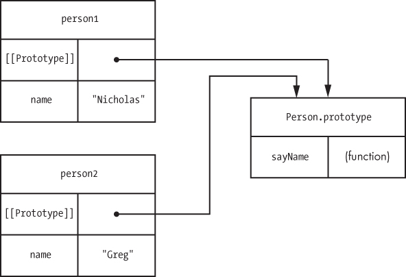
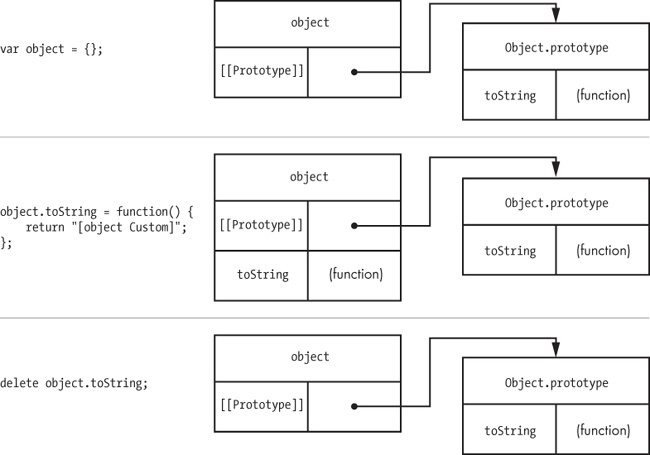
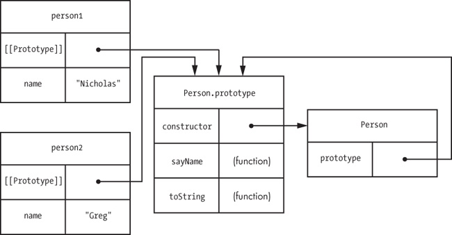

# Constructors

A _constructor_ is simply a function that is used with `new` to create an object. Because a constructor is just a function, you define it in the same way. The only difference is that constructor names should begin with a capital letter, to distinguish them from other functions. you can use the `instanceof` operator to deduce an object’s type.

```js
function Person(name) {
 this.name = name;
 this.sayName = function() {
	  console.log(this.name);
  };
}
var person1 = new Person('Remy');
console.log(person1 instanceof Person);     // true
```

Constructors allow you to initialize an instance of a type in a consistent way, performing all of the property setup that is necessary before the object can be used. You could also use `Object.defineProperty()` inside of a constructor to help initialize the instance:

```js
function Person(name) {
    Object.defineProperty(this, "name", {
        get: function() {
            return name;
        },
        set: function(newName) {
            name = newName;
        },
        enumerable: true,
        configurable: true
    });

    this.sayName = function() {
        console.log(this.name);
    };
}
```

# Prototypes

You can think of a _prototype_ as a recipe for an object. Almost every function (with the exception of some built-in functions) has a `prototype` property that is used during the creation of new instances.

You can determine whether a property is on the prototype by using a function such as:
```js
function hasPrototypeProperty(object, name) {
    return name in object && !object.hasOwnProperty(name);
}

console.log(hasPrototypeProperty(book, "title"));            // false
console.log(hasPrototypeProperty(book, "hasOwnProperty"));   // true
```





# Using Prototypes with Constructors

The shared nature of prototypes makes them ideal for defining methods once for all objects of a given type. Because methods tend to do the same thing for all instances, there’s no reason each instance needs its own set of methods.

```js
function Person(name) {
  this.name = name;
}

Person.prototype.sayName = function() {
  console.log(this.name);
};
Person.prototype.favorites = [];

var person1 = new Person("Nicholas");
var person2 = new Person("Greg");

person1.favorites.push("pizza");
person2.favorites.push("quinoa");

console.log(person1.favorites);     // "pizza,quinoa"
console.log(person2.favorites);     // "pizza,quinoa"
```


Using the object literal notation to overwrite the prototype changed the `constructor` property so that it now points to `Object` ❶ instead of `Person`

```js
function Person(name) {
  this.name = name;
}

Person.prototype = {
 constructor: Person, ❶

  sayName: function() {
	  console.log(this.name);
  },

  toString: function() {
	  return "[Person " + this.name + "]";
  }
};

var person1 = new Person("Nicholas");
var person2 = new Person("Greg");

console.log(person1 instanceof Person);         // true
console.log(person1.constructor === Person);    // true
console.log(person1.constructor === Object);    // false

console.log(person2 instanceof Person);         // true
console.log(person2.constructor === Person);    // true
console.log(person2.constructor === Object);    // false
```

Perhaps the most interesting aspect of the relationships among constructors, prototypes, and instances is that there is no direct link between the instance and the constructor. There is, however, a direct link between the instance and the prototype and between the prototype and the constructor. Illustrates this relationship: (An instance and its constructor are linked via the prototype.)




# Changing Prototypes

Because all instances of a particular type reference a shared prototype, you can augment all of those objects together at any time. Remember, the `[[Prototype]]` property just contains a pointer to the prototype, and any changes to the prototype are immediately available on any instance referencing it.

The ability to modify the prototype at any time has some interesting repercussions for sealed and frozen objects. When you use `Object.seal()` or `Object.freeze()` on an object, you are acting _solely_ on the object instance and the own properties. You can’t add new own properties or change existing own properties on frozen objects, but you can certainly still add properties on the prototype and continue extending those objects, as demonstrated in the following listing.

```js
  var person1 = new Person("Nicholas");
  var person2 = new Person("Greg");

❶ Object.freeze(person1);

❷ Person.prototype.sayHi = function() {
   console.log("Hi");
  };

person1.sayHi();                            // outputs "Hi"
person2.sayHi();                            // outputs "Hi"
```

# Built-in Object Prototypes

At this point, you might wonder if prototypes also allow you to modify the built-in objects that come standard in the JavaScript engine. The answer is yes. All built-in objects have constructors, and therefore, they have prototypes that you can change. For instance, adding a new method for use on all arrays is as simple as modifying `Array.prototype`.

```js
Array.prototype.sum = function() {
    return this.reduce(function(previous, current) {
        return previous + current;
    });
};

var numbers = [ 1, 2, 3, 4, 5, 6 ];
var result = numbers.sum();
```

```js
String.prototype.capitalize = function() {
    return this.charAt(0).toUpperCase() + this.substring(1);
};

var message = "hello world!";
console.log(message.capitalize());  // "Hello world!"
```

#Note : _While it may be fun and interesting to modify built-in objects to experiment with functionality, it’s not a good idea to do so in a production environment. Developers expect built-in objects to behave a certain way and have certain methods. _Deliberately_ altering built-in objects violates those expectations and makes other developers unsure how the objects should work._

---

See also: https://learning.oreilly.com/library/view/the-principles-of/9781457185304/ch04.html#constructors
