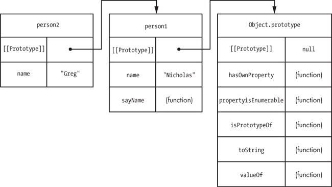
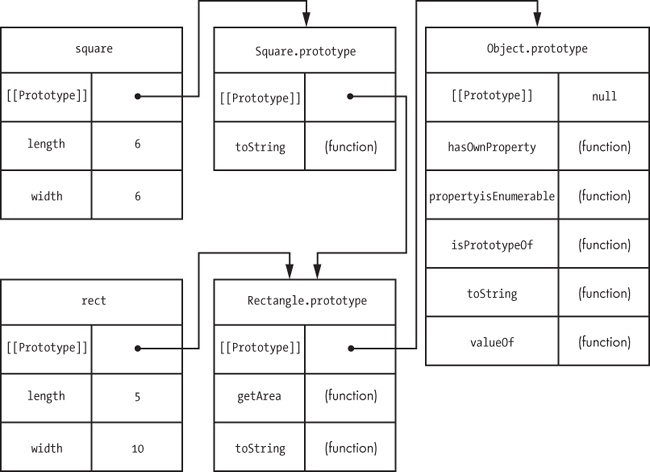

Learning how to create objects is the first step to understanding object-oriented programming. The second step is to understand inheritance. In traditional object-oriented languages, classes inherit properties from other classes.
In JavaScript, however, inheritance can occur between objects with no class like structure defining the relationship. The mechanism for this inheritance is one with which you are already familiar: prototypes.

# Prototype Chaining and Object.prototype

JavaScript’s built-in approach for inheritance is called _prototype chaining_, or _prototypal inheritance_.

### Methods Inherited from Object.prototype

Several of the methods used in the past couple of chapters are actually defined on `Object.prototype` and are therefore inherited by all other objects. Those methods are:
-   ****`hasOwnProperty()`****. Determines whether an own property with the given name exists
-   ****`propertyIsEnumerable()`****. Determines whether an own property is enumerable
-   ****`isPrototypeOf()`****. Determines whether the object is the prototype of another
-   ****`valueOf()`****. Returns the value representation of the object
-   ****`toString()`****. Returns a string representation of the object

### Modifying Object.prototype

All objects inherit from `Object.prototype` by default, so changes to `Object.prototype` affect all objects. That’s a very dangerous situation.
```js
Object.prototype.add = function(value) {
    return this + value;
};

var book = {
    title: "The Principles of Object-Oriented JavaScript"
};

console.log(book.add(5));           // "[object Object]5"
console.log("title".add("end"));    // "titleend"

// in a web browser
console.log(document.add(true));    // "[object HTMLDocument]true"
console.log(window.add(5));         // "[object Window]true"

var empty = {};

for (var property in empty) {
    console.log(property); // An empty object will still output "add" as a property because it exists on the prototype and is enumerable
}

// For this reason, Douglas Crockford recommends using `hasOwnProperty()` in `for-in` loops all the time
for (var property in empty) {
    if (empty.hasOwnProperty(property)) {
        console.log(property);  //
    }
}
```

# Object Inheritance

The simplest type of inheritance is between objects. All you have to do is specify what object should be the new object’s `[[Prototype]]`. Object literals have `Object.prototype` set as their `[[Prototype]]` implicitly, but you can also explicitly specify `[[Prototype]]` with the `Object.create()` method.

```js
// This object automatically inherits from `Object.prototype`
// And the property is set to be configurable, enumerable, and writable by default.
var book = {
	title: "The Principles of Object-Oriented JavaScript"
};

// is the same as
var book = Object.create(Object.prototype, {
	title: {
		configurable: true,
		enumerable: true,
		value: "The Principles of Object-Oriented JavaScript",
		writable: true
	}
});
```

Inheriting from other objects is much more interesting:
```js
var person1 = {
    name: "Nicholas",
    sayName: function() {
        console.log(this.name);
    }
};

var person2 = Object.create(person1, {
    name: {
        configurable: true,
        enumerable: true,
        value: "Greg",
        writable: true
    }
});

person1.sayName();                                  // outputs "Nicholas"
person2.sayName();                                  // outputs "Greg"
console.log(person1.hasOwnProperty("sayName"));     // true
console.log(person1.isPrototypeOf(person2));        // true
console.log(person2.hasOwnProperty("sayName"));     // false
```


# Constructor Inheritance

Object inheritance in JavaScript is also the basis of constructor inheritance.
`prototype` property is automatically assigned to be a new generic object that inherits from `Object.prototype` and has a single own property called `constructor`. In effect, the JavaScript engine does the following for you:

```js
// you write this
function YourConstructor() {
    // initialization
}

// JavaScript engine does this for you behind the scenes
YourConstructor.prototype = Object.create(Object.prototype, {
                                constructor: {
                                    configurable: true,
                                    enumerable: true,
                                    value: YourConstructor
                                    writable: true
                                }
                            });
```

`YourConstructor` is a _subtype_ of `Object`, and `Object` is a _supertype_ of `YourConstructor`
Because the `prototype` property is writable, you can change the prototype chain by overwriting it. Consider the following example:

```js
❶ function Rectangle(length, width) {
      this.length = length;
      this.width = width;
  }

  Rectangle.prototype.getArea = function() {
      return this.length * this.width;
  };

  Rectangle.prototype.toString = function() {
      return "[Rectangle " + this.length + "x" + this.width + "]";
  };

  // inherits from Rectangle
❷ function Square(size) {
      this.length = size;
      this.width = size;
  }

  Square.prototype = new Rectangle();
  Square.prototype.constructor = Square;

  Square.prototype.toString = function() {
      return "[Square " + this.length + "x" + this.width + "]";
  };

  var rect = new Rectangle(5, 10);
  var square = new Square(6);

  console.log(rect.getArea());        // 50
  console.log(square.getArea());      // 36

  console.log(rect.toString());       // "[Rectangle 5x10]"
  console.log(square.toString());     // "[Square 6x6]"

  console.log(rect instanceof Rectangle);     // true
  console.log(rect instanceof Object);        // true

  console.log(square instanceof Square);      // true
  console.log(square instanceof Rectangle);   // true
  console.log(square instanceof Object);      // true
```
In this code, there are two constructors: `Rectangle` ❶ and `Square` ❷. The `Square` constructor has its `prototype` property overwritten with an instance of `Rectangle`.




# Constructor Stealing

Because inheritance is accomplished through prototype chains in JavaScript, you don’t need to call an object’s supertype constructor. If you do want to call the supertype constructor from the subtype constructor, then you need to take advantage of how JavaScript functions work.

In Chapter 2, you learned about the `call()` and `apply()` methods, which allow functions to be called with a different `this` value. That’s exactly how _constructor stealing_ works.

```js
 function Rectangle(length, width) {
      this.length = length;
      this.width = width;
  }

  Rectangle.prototype.getArea = function() {
      return this.length * this.width;
  };

  Rectangle.prototype.toString = function() {
      return "[Rectangle " + this.length + "x" + this.width + "]";
  };

  // inherits from Rectangle
❶ function Square(size) {
      Rectangle.call(this, size, size);

      // optional: add new properties or override existing ones here
  }

  Square.prototype = Object.create(Rectangle.prototype, {
                          constructor: {
                              configurable: true,
                              enumerable: true,
                              value: Square,
                              writable: true
                          }
                      });

  Square.prototype.toString = function() {
      return "[Square " + this.length + "x" + this.width + "]";
  };

  var square = new Square(6);

  console.log(square.length);        // 6
  console.log(square.width);         // 6
  console.log(square.getArea());     // 36
```


# Accessing Supertype Methods
In the previous example, the `Square` type has its own `toString()` method that shadows `toString()` on the prototype. It is fairly common to override supertype methods with new functionality in the subtype, but what if you still want to access the supertype method? In other languages, you might be able to say `super.toString()`, but JavaScript doesn’t have anything similar. Instead, you can directly access the method on the supertype’s prototype and use either `call()` or `apply()` to execute the method on the subtype object. For example:

```js
  function Rectangle(length, width) {
      this.length = length;
      this.width = width;
  }

  Rectangle.prototype.getArea = function() {
      return this.length * this.width;
  };

  Rectangle.prototype.toString = function() {
      return "[Rectangle " + this.length + "x" + this.height + "]";
  };

  // inherits from Rectangle
  function Square(size) {
      Rectangle.call(this, size, size);
  }

  Square.prototype = Object.create(Rectangle.prototype, {
                          constructor: {
                              configurable: true,
                              enumerable: true,
                              value: Square,
                              writable: true
                          }
                      });
  // call the supertype method
❶ Square.prototype.toString = function() {
      var text = Rectangle.prototype.toString.call(this);
      return text.replace("Rectangle", "Square");
  };
```

This approach may seem a bit verbose for such a simple operation, but it is the only way to access a supertype’s method.

#### Summary:
JavaScript supports inheritance through prototype chaining. A prototype chain is created between objects when the `[[Prototype]]` of one object is set equal to another. All generic objects automatically inherit from `Object.prototype`. If you want to create an object that inherits from something else, you can use `Object.create()` to specify the value of `[[Prototype]]` for a new object.


----
See also: https://learning.oreilly.com/library/view/the-principles-of/9781457185304/ch05.html#prototype_chaining_and_objectdotprototyp

JS Code Conventions: https://www.crockford.com/code.html